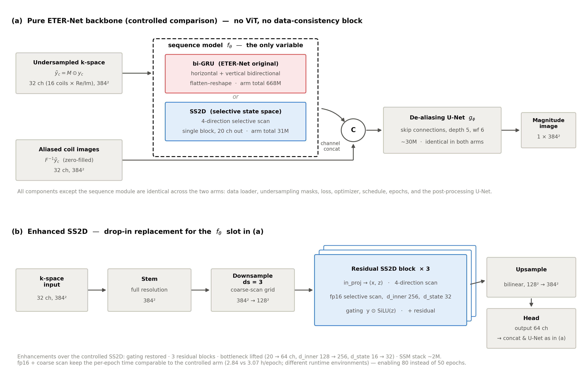
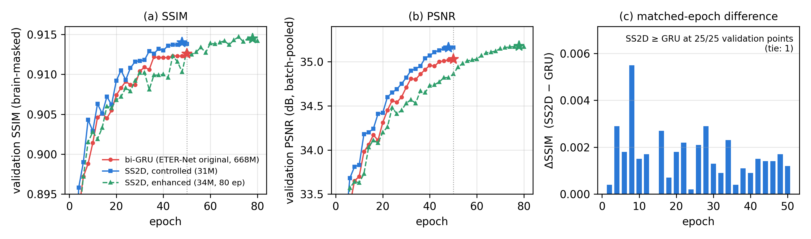
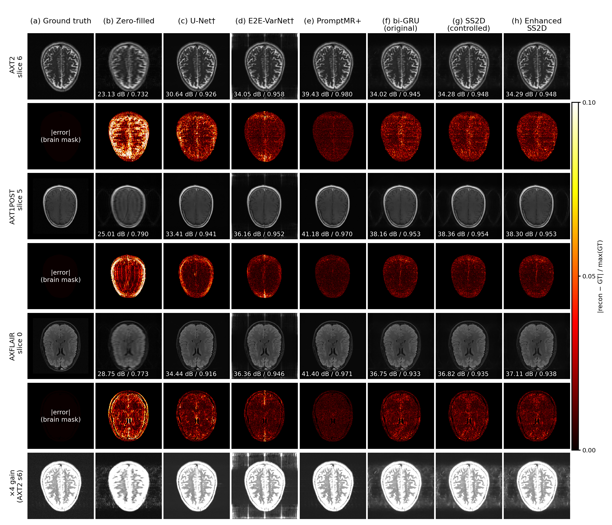
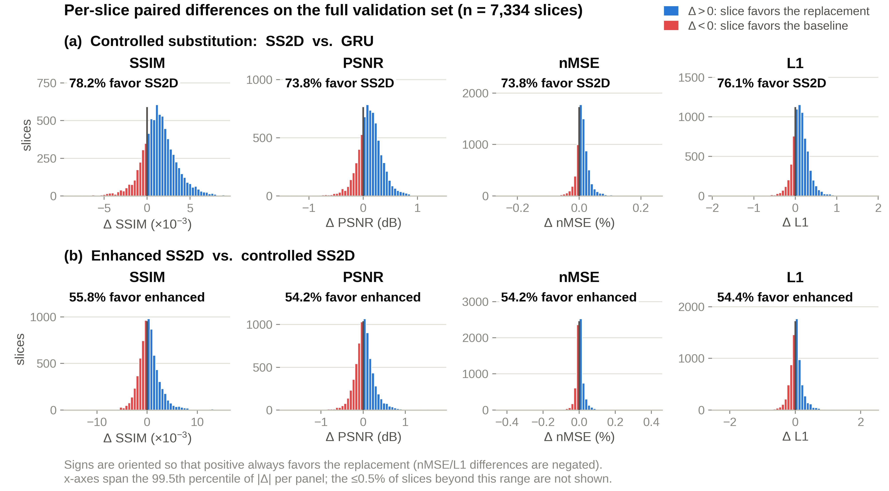

# 직접 k-space-영상 MRI 재구성 네트워크 ETER-Net에서 순환신경망을 선택적 상태공간모델로 치환한 단일 변수 통제 비교

**A Controlled Single-Variable Comparison of Replacing the Recurrent Neural Network with a Selective State-Space Model in ETER-Net for Direct k-Space-to-Image MRI Reconstruction**

*(대한전자공학회 투고용 논문 양식 2021 — 저자·소속은 투고 시스템/게재용 양식에서 기입)*

## 요 약

ETER-Net은 언더샘플된 k-space를 양방향 순환신경망(bi-RNN)으로 영상 도메인에 직접 변환하는 MRI 재구성 계열이다. 본 논문은 이 골격에서 도메인 변환 자리의 시퀀스 모델 하나만을 단일 변수로 통제하여, 원 설계의 bi-GRU를 선택적 상태공간모델(SS2D)로 치환했을 때의 효과를 정량 평가한다. fastMRI brain multicoil 데이터(384×384, R=4)에서 두 모델은 시퀀스 모델을 제외한 모든 구성요소(데이터로더·마스크·손실·최적화·후처리 U-Net)를 공유하며, 원 논문에 충실하게 명시적 data-consistency(DC) 블록 없이 학습된다. 검증 7,334 슬라이스(464 볼륨)에 대한 paired 비교에서 SS2D 치환 모델은 21배 적은 파라미터(31M 대 668M)로 볼륨 단위 평균 brain-masked SSIM 0.9141(GRU 0.9127), PSNR 33.91 dB(33.78 dB)를 기록해 표준 지표(SSIM·PSNR·nMSE) 전부에서 원 bi-GRU 설계를 상회했으며, 지표별로 슬라이스의 74~78%, 볼륨의 90~95%에서 우위였다(볼륨 단위 Wilcoxon signed-rank, p<0.001). 정성적으로 GRU 재구성의 두개골 외부 배경에서 관찰되는 주기적 ringing 아티팩트가 SS2D에서는 나타나지 않았다. 통제를 해제한 강화 SS2D 변형(게이팅·잔차 스택·병목 해제·coarse-scan)은 더 긴 학습 스케줄(80 epoch)을 소화해 SSIM을 0.9146으로 추가 개선했으나 이득은 근소했다(슬라이스의 54~56% 우위). 본 결과는 직접 도메인 변환형 재구성에서 SS2D 치환이 DC의 도움 없이, 대폭 적은 파라미터로, 원 bi-GRU 설계에 대해 일관된 품질 이득을 줌을 통제된 조건에서 보인 것이다.

## Abstract

ETER-Net is a family of MRI reconstruction networks that directly transforms undersampled k-space into the image domain with a bidirectional recurrent neural network (bi-RNN). This paper isolates the sequence model at the domain-transformation slot of this backbone as the single controlled variable and quantifies the effect of replacing the original bi-GRU with a selective state-space model (SS2D). On the fastMRI brain multicoil dataset (384×384, R=4), the two models share every component except the sequence model (data loader, undersampling masks, loss, optimizer, and the post-processing U-Net) and are trained without an explicit data-consistency (DC) block, faithfully to the original design. In a paired comparison over all 7,334 validation slices (464 volumes), the SS2D replacement, with 21× fewer parameters (31M vs. 668M), achieved a volume-averaged brain-masked SSIM of 0.9141 (GRU: 0.9127) and a PSNR of 33.91 dB (33.78 dB), outperforming the original bi-GRU design on all standard metrics (SSIM, PSNR, nMSE); it was superior on 74–78% of slices and 90–95% of volumes per metric (volume-level Wilcoxon signed-rank test, p<0.001). Qualitatively, the periodic ringing artifacts observed outside the skull in the GRU reconstructions were absent in the SS2D reconstructions. An enhanced SS2D variant with the controls released (gating, residual stacking, a widened bottleneck, and coarse scanning) absorbed a longer schedule (80 epochs) and further improved SSIM to 0.9146, although the gain was marginal (superior on 54–56% of slices). These results show, under controlled conditions, that the SS2D substitution yields a consistent quality gain over the original bi-GRU design in direct domain-transformation reconstruction, without DC and with far fewer parameters.

**Keywords :** MRI reconstruction, k-space-to-image, recurrent neural network, selective state-space model, parameter efficiency

---

## Ⅰ. 서  론

MRI는 전리방사선 없이 뛰어난 연조직 대조도를 제공하는 핵심 진단 기법이지만 근본적으로 느린 영상법이다. 스캐너가 실제로 수집하는 것은 영상의 2차원 푸리에 계수인 k-space이며, k-space는 통상 한 번의 반복시간(TR)마다 한 줄(phase-encoding line)씩 순차적으로 채워진다. 나이퀴스트 조건을 만족하는 완전한 수집에는 시퀀스당 수 분, 다중 contrast 검사 전체로는 수십 분이 소요되고, 이 수집 속도는 경사자계 전환에 따른 말초신경 자극이나 RF 에너지 축적(SAR) 같은 물리·생리적 안전 한계로 제약되므로 하드웨어만으로는 근본적으로 단축할 수 없다[1, 2]. 긴 촬영은 환자의 부담과 모션 아티팩트, 검사 처리량 저하와 비용 증가로 직결된다[1-3]. 따라서 k-space의 일부만 수집하고(언더샘플링) 부족한 정보를 복원으로 메우는 가속 MRI는 오랜 중심 과제였으며, 최근 딥러닝 재구성은 표준 촬영과의 진단 호환성 입증[4]과 촬영 시간을 절반으로 줄인 임상 운용[5]을 거쳐 가속 상한을 탐구하는 단계에 이르렀다[6]. 남은 관건은 어떤 모델 구조가 이 복원 문제를 더 정확하고 효율적으로 푸는가이다.

나이퀴스트 조건을 어긴 k-space를 그대로 역푸리에 변환하면 해부 구조가 겹치는 aliasing 아티팩트가 생기고, 원본 복원은 유일해가 없는 ill-posed 역문제가 된다. 다중 수신 코일의 공간 감도를 이용하는 병렬영상 SENSE[7]와 GRAPPA[8]는 임상 표준이 되었으나 가속률이 커지면 노이즈 증폭이 급격해지고, 압축센싱[9]은 반복 최적화의 긴 재구성 시간과 정규화 파라미터 민감성이 보급의 병목이었다[3]. 2016년 이후 딥러닝이 이 자리를 대체하기 시작했으며[10], 방법론은 크게 두 계열로 나뉜다[2, 11]. 첫째, unrolled 최적화 계열은 반복 최적화 알고리즘을 신경망 층으로 펼치고 물리 모델(데이터 일관성, DC)을 매 반복에 끼워 넣는다 — Variational Network[12], Deep Cascade CNN[13], MoDL[14]이 원형이고, 코일 감도까지 종단 학습하는 E2E-VarNet[15]이 fastMRI 챌린지를 거치며 사실상의 표준 기준선으로 자리잡았다[16, 17]. 둘째, 직접 도메인 변환 계열은 센서(k-space) 도메인에서 영상 도메인으로의 변환 자체를 신경망이 학습한다 — AUTOMAP[18]이 완전연결층으로 이를 처음 보였고, DOTA-MRI[19]는 주파수-인코딩 방향 1차원 역푸리에 변환을 해석적으로 선행해 파라미터 벽을 낮췄으며, ETER-Net[20]은 그 자리를 양방향 RNN으로 대체해 파라미터를 크게 줄였다. 이 밖에 score 기반 생성모델 계열[21, 22]이 세 번째 축으로 부상했고, 공정한 비교의 기반으로는 대규모 raw k-space 공개 데이터셋 fastMRI[1, 23]와 그 챌린지[16, 17]가 표준 벤치마크로 자리잡았다.

본 연구는 두 번째 계열, 그중에서도 ETER-Net 계열[20, 24-26]의 심장부인 도메인 변환 시퀀스 모델에 주목한다. ETER-Net의 bi-RNN(GRU)은 k-space의 행과 열을 순차로 읽어 영상 특징으로 변환하는데, flatten-reshape 구조 탓에 파라미터가 비대해지고(본 설정에서 668M) 순차 의존으로 병렬화가 제한된다. 한편 선택적 상태공간모델 Mamba[27]는 입력 의존 상태 전이로 장거리 의존을 선형 복잡도로 모델링하며, 4방향 selective scan으로 2차원에 확장한 SS2D(VMamba)[28] 이후 비전 과제에서 RNN과 Transformer의 대안으로 빠르게 자리잡았다. MRI 재구성에 Mamba를 적용한 연구도 이미 다수 존재하지만[29-37], 이들은 모두 영상 도메인 prior·정규화기 또는 unrolled 백본 자리에 SSM을 넣는 새 아키텍처 제안이다. 본 논문에서 "도메인 변환 자리"란 언더샘플된 k-space를 입력받아 영상 도메인 특징을 직접 출력함으로써 역푸리에 변환의 역할 자체를 학습으로 대체하는 모듈(입력=k-space, 출력=영상 도메인)을 가리킨다. 이 자리의 RNN을 SSM으로 1:1 치환하면 무엇이 달라지는가에 대한 통제 비교는, 우리가 아는 한 문헌에 없다. 우리의 선행 내부 실험(ViT 인코더 하이브리드[26] 유사 구조)에서 GRU(+U-Net 후처리) 대 SS2D(+DC) 비교는 brain-masked SSIM 0.9084 대 0.9083의 사실상 동률로 끝났으나, 이 비교는 DC 유무와 후처리 구조가 시퀀스 모델 종류와 얽힌 confound를 안고 있었다. 본 연구는 confound를 제거한 순수 골격에서 질문을 격리한다: "직접 도메인 변환 자리에서 SS2D 치환은 원 bi-GRU 설계보다 나은가?"

본 논문의 기여는 다음 세 가지다. 첫째, ETER-Net 골격(ViT 없음, DC 없음)에서 시퀀스 모델만 GRU에서 SS2D로 교체한 단일 변수 통제 실험으로, 21배 적은 파라미터(31M 대 668M)의 SS2D가 표준 지표(SSIM·PSNR·nMSE) 전부, matched-epoch 전 구간, 검증 슬라이스의 74~78%(볼륨의 90~95%)에서 원 설계를 일관되게 상회함을 보인다. 둘째, DC가 전혀 없는 조건에서의 우위로 선행 동률 결과에 대한 "SS2D는 DC 덕"(DC-crutch) 가설을 반박하고, 도메인 변환형 골격에 종단 single soft-DC를 붙이는 것이 unrolled 문헌의 DC 관행과 구조적으로 다름을 정리해 no-DC 설계를 정당화한다. 셋째, 게이팅·잔차 스택·병목 해제·coarse-scan을 더한 강화 SS2D로 통제 해제 시의 상한을 탐색하고, matched-epoch 기준의 정직한 해석을 함께 제시한다. 이하 Ⅱ장은 관련 연구, Ⅲ장은 골격·변형·손실과 평가지표, Ⅳ장은 실험 프로토콜과 결과, Ⅴ장은 고찰, Ⅵ장은 결론이다.

## Ⅱ. 관련 연구

### 1. 직접 도메인 변환 계열

AUTOMAP[18]은 센서→영상 매핑을 완전연결층으로 통째로 학습할 수 있음을 보였으나 해상도 제곱에 비례하는 파라미터가 실용의 벽이었다. DOTA-MRI[19]는 주파수-인코딩 방향 1차원 역푸리에 변환을 해석적으로 선행하고 phase-encoding 방향의 1차원 전역 변환만 학습해 이 벽을 O(N²)에서 O(N)으로 낮췄다. ETER-Net[20]은 이 변환을 수평·수직 양방향 RNN 두 개로 분해해 파라미터를 낮추고 CNN(U-Net)에 de-aliasing을 맡기는 구조로, R=4에서 SSIM 0.931을 보고했으며 명시적 DC 블록이 없다. 이후 radial 등 non-Cartesian 궤적으로 확장되었고[24], folded image를 보조 입력으로 더해 랜덤·불규칙 궤적과 R∈{4, 8}에서 안정성을 높인 dual-input ETER-net[25]으로 이어졌으며, 최근에는 ViT 인코더와의 하이브리드[26]가 제안되어 bi-RNN의 k-space 순차 처리가 고가속·랜덤 샘플링 강건성의 핵심임이 보고되었다. k-space 도메인 CNN을 포함하는 교차 도메인 계열로는 KIKI-net[38]이 있다. 본 연구는 이 계열[20, 25, 26]의 골격을 유지한 채 도메인 변환 모듈만 교체하는 직접 후속(ablation) 연구다.

### 2. Unrolled 최적화·DC 계열

CRNN-MRI[39], Variational Network[12], Deep Cascade[13], MoDL[14], E2E-VarNet[15], RecurrentVarNet[40], CIRIM[41] 등은 공통적으로 작은 recurrent 또는 conv unit을 최적화 반복으로 unroll하고 DC를 매 반복에 interleave한다. 체계적 비교 연구[42]가 정리하듯 DC는 이 계열의 초석이다. 병렬영상 연산을 신경망과 명시적으로 결합한 GrappaNet[43]도 넓게는 이 물리 주도 계열에 속한다. 반면 본 골격(거대 bi-RNN/SSM 도메인 변환 + 종단 U-Net)은 unroll 반복이 없으며 원 논문[20]에도 DC가 없다. 따라서 본 비교는 no-DC를 기본 축으로 설계했다(근거는 Ⅴ장).

### 3. Transformer·SSM 기반 MRI 재구성

attention의 전역 수용영역을 활용한 Transformer 계열 — SwinMR[44], HUMUS-Net[45], recurrent 구조와 결합한 ReconFormer[46] — 이 CNN의 지역성 한계를 공략해 왔으나, 시퀀스 길이 제곱의 연산이 고해상도에서 부담이다. Mamba[27]와 그 2차원 확장 SS2D/VMamba[28]는 같은 전역 문맥을 선형 복잡도로 제공한다. MRI 재구성 적용은 이미 활발하다: 영상·이중 도메인 prior로서의 MambaRecon[29], DH-Mamba[30], CAM[32], HiFi-Mamba[33], 불확실성 추정을 겸한 MambaMIR[36], 다중 모달 융합 MMR-Mamba[37], unrolled 백본으로서의 MambaRoll[31]과 SO-Mamba[35], 연산자 학습 관점의 LMO[34] 등이다. 특히 DH-Mamba[30]는 이중 도메인 구조의 k-space 브랜치에서 SSM 스캔을 수행하며 k-space 직접 스캔의 스펙트럼 파괴 위험을 지적했다. 그러나 그 구조에서 k-space와 영상 도메인 사이의 이동은 여전히 명시적 (i)FFT가 담당하고 SSM은 각 도메인 안의 보정(prior) 역할이다. 이들 연구는 새 아키텍처 제안과 최고 성능 경쟁이 목적이며, SSM의 자리는 도메인 내부의 prior·정규화기다. 본 연구는 기존 골격에서 RNN↔SSM 치환 효과를 격리하는 통제 실험이 목적이며, (i)FFT의 역할 자체를 학습하는 도메인 변환 자리의 SSM은 우리가 아는 한 이들 연구 어디에도 없다. 표 1은 본 연구의 위치를 요약한다.

표 1. 관련 계열과 본 연구의 위치  
Table 1. Position of this study relative to related families

| Family | Slot of the sequence/global module | DC | Relation to this study |
|---|---|---|---|
| Direct domain transform [18-20, 25, 26, 38] | k-space→image transform itself | None (original) | Backbone of this study |
| Unrolled + DC [12-15, 39-41] | Small unit inside iterations | Every iteration | Different structure; not compared |
| Mamba-MRI [29-37] | Image/dual-domain prior, unrolled backbone | Mostly | SSM at a different slot |
| This study | RNN↔SSM 1:1 substitution at the domain-transform slot | None (controlled) | Fills the missing controlled comparison |

## Ⅲ. 방  법

### 1. 문제 정식화

C개 코일의 fully-sampled k-space를 y={y_c}, 언더샘플링 마스크를 M이라 하면 관측은 다음과 같다.

$$ \tilde{y}_c = M \odot y_c, \quad c = 1, \ldots, C \qquad (1) $$

목표는 관측 {ỹ_c}로부터 기준 영상 x*(root-sum-of-squares, RSS magnitude)를 복원하는 것이다. Unrolled 계열이 ‖MFx−ỹ‖²+R(x)를 최소화하는 반복을 펼치는 것과 달리, 직접 도메인 변환 계열은 매핑

$$ \hat{x} = g_{\phi}\left( \mathrm{concat}\left( f_{\theta}(\{\tilde{y}_c\}), \mathcal{F}^{-1}\{\tilde{y}_c\} \right) \right) \qquad (2) $$

을 종단 학습한다. 여기서 f_θ는 k-space 입력을 영상 도메인 특징으로 변환하는 시퀀스 모델(본 연구의 유일한 변수: bi-GRU 또는 SS2D), F⁻¹{ỹ_c}는 zero-filled(aliased) 코일 영상, g_φ는 de-aliasing 후처리 U-Net이다. f_θ를 제외한 모든 것을 고정한다.

### 2. 공통 골격과 두 팔

그림 1(a)는 두 팔이 공유하는 순수 ETER-Net 골격이다. 입력은 aliased 코일 영상과 k-space 각각 (B, 32, 384, 384) 텐서(16코일 × 실수부/허수부)이고, 시퀀스 모델 f_θ가 k-space를 영상 도메인 특징으로 변환한 뒤 aliased 코일 영상과 채널 방향으로 결합(2-way concat)되어 후처리 U-Net g_φ(skip connection, depth 5, width factor 6, 약 31.1M 파라미터)로 들어가며, 출력은 (B, 1, 384, 384)의 magnitude 영상이다. ViT 인코더[26]와 DC 블록은 두 팔 모두 두지 않는다.

그림 1. (a) 두 팔이 공유하는 순수 ETER-Net 골격 — 시퀀스 모델 f_θ(bi-GRU 또는 SS2D)만이 유일한 변수이며, 데이터로더·마스크·손실·최적화·스케줄·후처리 U-Net은 동일하다. (b) 통제를 해제한 강화 SS2D 변형(게이팅·잔차 스택 3블록·병목 해제·fp16 coarse-scan)  
Fig. 1. (a) The pure ETER-Net backbone shared by both arms — the sequence model f_θ (bi-GRU or SS2D) is the only variable; the data loader, masks, loss, optimizer, schedule, and post-processing U-Net are identical. (b) The enhanced SS2D variant with the controls released (gating, three residual blocks, widened bottleneck, and fp16 coarse scan)

#### 가. bi-GRU 팔 (원 설계)

ETER-Net 원본[20]의 양방향(수평 + 수직) GRU로, k-space의 각 행(열)을 flatten하여 GRU에 순차 입력하고 출력을 다시 reshape하는 구조다. hidden 배수는 원 코드의 두 설정(canonical 12 / 실험 config 10) 중 10을 채택해 총 668.2M 파라미터이며, canonical 12로는 880.5M이다(재현 클래스가 원본 클래스와 동일 설정에서 파라미터 수가 완전히 일치함을 검증하였다). 즉 10의 채택은 GRU를 더 작게 잡는 보수적 선택이며, 본문의 파라미터 격차 21배는 canonical 기준(28배)의 하한이다.

#### 나. SS2D 팔 (치환, 통제판)

Mamba[27]의 선택적 상태공간모델은 이산화된 선형 시불변 시스템의 전이·입력·출력 행렬을 입력에 의존하게 만든(selective) 순환 구조로, 시퀀스 원소 x_t에 대해

$$ h_t = \exp(\Delta_t A)\, h_{t-1} + \Delta_t B_t x_t, \quad y_t = C_t h_t + D x_t \qquad (3) $$

를 계산한다. 여기서 Δ_t, B_t, C_t는 x_t의 선형 함수이고, A와 D는 학습 파라미터다. 이 재귀는 병렬 스캔으로 시퀀스 길이에 선형인 비용으로 계산된다. SS2D[28]는 2차원 특징맵을 네 방향(좌→우, 우→좌, 상→하, 하→상)으로 펼쳐 각각 selective scan을 수행한 뒤 합산함으로써 2차원 전역 수용영역을 만든다. 통제판 SS2D 팔은 이 4방향 selective scan 단일 블록(d_inner 128, d_state 16)이며, 출력 채널을 GRU 팔과 동일한 20으로 강제 정합해 용량 상한을 GRU 이하로 억제하였다. 총 파라미터는 31.2M으로, 이 중 공유 U-Net이 31.1M으로 지배적이고 SSM 스택 자체는 0.12M이다. 이 외 모든 것 — 데이터로더·언더샘플링 마스크·손실·옵티마이저·스케줄·epoch·후처리 U-Net — 이 동일하다. 난수 시드는 두 런 모두 고정하지 않았으며, 시드 민감도는 별도의 멀티시드 실험으로 검증한다(Ⅴ장).

### 3. 강화 SS2D (통제 해제 변형)

통제비교의 SS2D는 공정성을 위해 의도적으로 최소 구성이다. 그림 1(b)의 강화 변형은 세 가지를 복원·확장한다. 첫째, 게이팅 복원 — 공식 Mamba[27]의 y = y·SiLU(z) 게이트 분기(통제판에는 없음). 둘째, 잔차 스택 — 채널 불변 SS2D 블록 3개를 residual skip으로 쌓는다. 셋째, 병목 해제 — 출력 채널 20→64, d_inner 128→256, d_state 16→32, dropout 0.05. 384² 풀해상도 4방향 스캔의 연산 병목은 fp16 selective scan과 다운샘플 front-end(ds=3)로 해결했다: stem이 풀해상도 k-space를 먼저 처리한 뒤 특징을 128²로 낮춰 coarse scan하고 bilinear 업샘플해 U-Net에 전달한다(전역 문맥은 SSM, 풀해상도 디테일은 U-Net이 분담). 그 결과 풀용량을 유지한 채 epoch당 학습시간을 통제판과 비슷한 수준으로 눌러(Ⅳ장 8절) 실험 기간 내에 epoch 50→80 연장이 가능했다. 총 파라미터는 약 33M(SSM 스택 약 2M)이다. 학습 위생으로 Mamba 상태 파라미터(A, D)는 weight decay에서 제외했다.

### 4. 손실 함수와 평가지표

배경(영상의 절반 이상)이 지표를 부풀리는 것을 차단하기 위해 모든 손실과 지표는 brain mask m(Otsu 임계 × 0.4 + 최대 연결성분) 내부에서 계산한다. 손실은 masked L1과 (1−SSIM)의 합이다.

$$ \mathcal{L} = \frac{\sum_{i} m_i \left| \hat{x}_i - x^{*}_i \right|}{\sum_{i} m_i} + \left( 1 - \mathrm{SSIM}_m(\hat{x}, x^{*}) \right) \qquad (4) $$

평가지표는 전부 슬라이스 단위로 정의하고, 보고 단위는 fastMRI 공식 평가[1]와 같은 볼륨으로 한다(슬라이스 값을 볼륨별로 평균한 뒤 464 볼륨에 대한 평균±표준편차). SSIM은 skimage의 structural_similarity를 전체 영상에서 계산(기본 윈도, data_range = 마스크 내부 x*의 최대−최소)한 뒤 SSIM map을 마스크 픽셀에서만 평균한 값이다. PSNR과 NMSE는 다음과 같이 정의한다.

$$ \mathrm{PSNR} = 20 \log_{10} \frac{\max_{m}(x^{*})}{\sqrt{\mathrm{MSE}_m}}, \quad \mathrm{MSE}_m = \frac{\sum_{i} m_i (\hat{x}_i - x^{*}_i)^2}{\sum_{i} m_i} \qquad (5) $$

$$ \mathrm{NMSE} = \frac{\sum_{i} m_i (\hat{x}_i - x^{*}_i)^2}{\sum_{i} m_i (x^{*}_i)^2} \qquad (6) $$

NMSE는 문헌 관례에 따라 백분율(nMSE, %)로 표기한다. 손실의 L1 항(마스크 내 평균 절대오차)은 학습용이며 결과 표에는 넣지 않는다. 본문과 결과 표(표 2·표 4)의 수치는 볼륨 단위 통계로 통일하고, paired 분석(표 3·그림 4)은 슬라이스 단위 차이와 볼륨 단위 검정을 병행한다. 학습 로그의 배치 풀링 수치(슬라이스 단위 평균과 등가)는 학습 곡선(그림 2)과 matched-epoch 비교에만 사용한다. 주 지표는 SSIM(fastMRI 챌린지 표준[16, 17])이고 나머지는 병기한다. 모델 없는 하한 기준선으로 zero-filled 재구성(언더샘플 k-space의 역 FFT 코일 영상 RSS, 강도 보정 없음)을 같은 좌표계·같은 지표식으로 계산해 표 2에 함께 제시한다. 본 지표는 뇌 영역 한정이므로 배경을 포함하는 fastMRI 공식 프로토콜(320 crop·raw)의 리더보드·문헌 수치와는 좌표계가 달라 직접 대조하지 않는다. 한편 마스킹은 GRU의 두개골 외부 아티팩트(Ⅳ장 5절)에 벌점을 주지 않으므로, 본 비교 맥락에서는 GRU에 유리한 보수적 선택이다. Best checkpoint와 조기 종료 기준으로는 SSIM·PSNR·NMSE를 가중 합성한 내부 스칼라를 사용했으나, 이 스칼라는 문헌 표준이 아니므로 본 논문의 모든 결과 표와 수치는 표준 지표로만 제시하며 결론은 표준 지표 전부에서 성립한다.

## Ⅳ. 실  험

### 1. 데이터셋과 언더샘플링 프로토콜

fastMRI brain multicoil[1, 23] 공식 배포본의 확보 서브셋을 사용하였다. 데이터는 혼합 contrast(AXT1/AXT1POST/AXT1PRE/AXT2/AXFLAIR)이며, 공식 train/val 구획 분리를 그대로 따랐다(구획 간 교차 없음): train 4,108 파일 / 65,028 슬라이스(확보 4,110개 중 reconstruction_rss가 없는 2개 제외), val 464 파일 / 7,334 슬라이스(확보분 전부 사용). 정답(GT)은 데이터셋 제공 RSS 재구성을 384×384로 center-crop/zero-pad한 것이다. 전처리는 full k-space → iFFT(ortho) → 영상 도메인 384×384 crop/pad → 재-FFT로 384² k-space를 유도하는 retrospective 프로토콜이다. 코일은 앞 16개를 사용(초과분 절단, 부족분 zero-fill)해 실수·허수 분리 32채널로 만들었으며, 코일 압축(SCC/GCC) 대신 재현 단순성을 위한 선택이다. 언더샘플링은 R=4 equispaced Cartesian 1차원 마스크(중앙 ACS 8%; train은 매 샘플 offset 랜덤, val은 고정)이고, 증강은 수평·수직 flip p=0.5로 flip 후 FFT를 재계산해 k-space 물리 정합을 유지했다.

### 2. 학습 세부

Adam(학습률 2×10⁻⁴), cosine annealing 스케줄, AMP(fp16), gradient clipping 1.0, batch size 8을 사용했다. 통제비교는 50 epoch, 강화판은 80 epoch이며 검증은 매 2 epoch 수행했다. 하드웨어는 NVIDIA TITAN RTX 24GB 단일 GPU, 구현은 PyTorch 2.3과 mamba_ssm 2.2(CUDA selective-scan 커널)이다. 코드는 게재 시 공개할 계획이다.

### 3. 통계 분석

두 모델이 동일 슬라이스를 재구성하는 paired 설계다. 지표별 paired 차이에 Wilcoxon signed-rank 검정(양측, 유의수준 0.05)을 적용하고, 효과크기로 우위 슬라이스 비율(통계학의 probabilistic index[47]에 해당, 임상시험의 win-ratio 계열[48]과 동족)을 함께 보고한다. 같은 볼륨의 슬라이스들은 독립이 아니므로(클러스터 구조) 슬라이스 단위와 볼륨 단위 분석을 병행한다: 볼륨별 평균 paired 차이에 대한 Wilcoxon signed-rank(n=464)와 볼륨 단위 우위 비율을 보고하고, 슬라이스 단위 우위 비율과 평균 차이의 95% 신뢰구간(CI)은 볼륨 클러스터 부트스트랩(2,000회)으로 구한다. 3개 지표에 Bonferroni 보정(×3)을 적용해도 본문의 모든 유의성 결론은 불변이다. p값은 관례에 따라 p<0.001로 표기한다.

### 4. 통제 비교 결과

표 2는 best checkpoint 기준 결과(zero-filled 기준선 포함)이고, 표 3은 슬라이스 단위 paired 비교다. SS2D 치환 모델은 21배 적은 파라미터로 표준 지표 전부에서 원 bi-GRU 설계를 상회했다(SSIM 0.9141 대 0.9127, PSNR 33.91 대 33.78 dB, nMSE 0.438 대 0.448 %).

표 2. 검증 집합 전체(464 볼륨/7,334 슬라이스, R=4, brain-masked)에 대한 best checkpoint 결과(볼륨 단위 평균±표준편차, 최고값 굵게·차선 밑줄). 첫 행은 모델 없는 zero-filled 기준선, 이어지는 두 행이 통제 비교이며, 마지막 행은 통제를 해제한 강화 변형이다  
Table 2. Best-checkpoint results on the full validation set (464 volumes/7,334 slices, R = 4, brain-masked); mean±SD over volumes, best in bold, second best underlined. The first row is the model-free zero-filled reference, the next two rows form the controlled comparison, and the last row is the enhanced variant with the controls released

| Method | Params (M) | Best epoch | SSIM ↑ | PSNR (dB) ↑ | nMSE (%) ↓ |
|---|---|---|---|---|---|
| Zero-filled | – | – | 0.7523±0.0410 | 24.76±2.11 | 3.935±2.166 |
| bi-GRU (original) | 668 | 50/50 | 0.9127±0.0366 | 33.78±1.86 | 0.448±0.274 |
| SS2D (controlled) | 31 | 48/50 | <u>0.9141±0.0365</u> | <u>33.91±1.90</u> | **0.438±0.283** |
| Enhanced SS2D | 33 | 78/80 | **0.9146±0.0361** | **33.92±1.90** | <u>0.439±0.304</u> |

Zero-filled: RSS of the inverse FFT of the undersampled k-space without intensity rescaling. Public fastMRI leaderboard U-Net/E2E-VarNet checkpoints are not listed because they were trained on the train+val split and evaluated under a different protocol (see text).

표 3. 슬라이스 단위 paired 비교(검증 7,334 슬라이스). Δ = 행의 모델 − 비교 대상이며 양수가 행의 모델 우위 방향(nMSE는 부호 반전, 그림 4 규약과 동일). CI는 볼륨 클러스터 부트스트랩 2,000회, p는 볼륨 단위 Wilcoxon signed-rank(n=464)  
Table 3. Slice-level paired comparisons (7,334 validation slices). Δ = row method − comparator, oriented so that positive favors the row method (sign flipped for nMSE, as in Fig. 4). CIs from a volume-cluster bootstrap (2,000 resamples); p from the volume-level Wilcoxon signed-rank test (n = 464)

| Comparison | Metric | Δ median (IQR) | Slices favoring (%) [95% CI] | Volumes favoring (%) | p |
|---|---|---|---|---|---|
| SS2D vs. bi-GRU | SSIM | +0.0013 (+0.0002, +0.0025) | 78.2 [76.8, 79.7] | 94.8 | <0.001 |
|  | PSNR (dB) | +0.12 (−0.01, +0.26) | 73.8 [72.1, 75.5] | 89.9 | <0.001 |
|  | nMSE (10⁻³ %) | +8.9 (−0.6, +20.6) | 73.8 [72.0, 75.5] | 90.1 | <0.001 |
| Enhanced vs. SS2D | SSIM | +0.0002 (−0.0009, +0.0015) | 55.8 [53.8, 57.6] | 66.4 | <0.001 |
|  | PSNR (dB) | +0.02 (−0.11, +0.15) | 54.2 [52.5, 55.9] | 58.6 | <0.001 |
|  | nMSE (10⁻³ %) | +1.2 (−7.5, +11.4) | 54.2 [52.5, 55.9] | 61.4 | <0.001 |

우위는 소수 슬라이스나 소수 볼륨에 의한 것이 아니라 대다수 슬라이스(74~78%)와 압도적 다수 볼륨(90~95%)에서 일관되었으며, 슬라이스 평균 Δ의 클러스터 부트스트랩 95% CI도 세 지표 전부 0을 배제하였다(예: ΔSSIM +0.0014 [+0.0013, +0.0015]). 그림 4(a)는 지표별 paired 차이의 분포다. 또한 그림 2의 학습 곡선에서 25개 검증 지점(epoch 2~50) 전부에서 SS2D의 SSIM이 GRU 이상이었고(Δ +0.0000~+0.0055; 동률은 epoch 14 한 지점뿐), PSNR은 전 지점 우위였다. ViT 하이브리드 선행 실험에서 관찰됐던 후반 역전(crossover)은 없었다. 다만 이 곡선은 시드를 고정하지 않은 단일 런의 단일 궤적임에 유의해야 한다(Ⅴ장).

그림 2. 학습 곡선(검증, 매 2 epoch, 배치 풀링 로그값 — 볼륨 단위 표 2와 직접 비교 불가). (a) SSIM, (b) PSNR, (c) matched-epoch ΔSSIM(SS2D − GRU). 별표는 각 팔의 best epoch, 점선은 통제 비교의 epoch 50  
Fig. 2. Learning curves (validation every 2 epochs, batch-pooled log values — not directly comparable with the volume-level Table 2). (a) SSIM, (b) PSNR, (c) matched-epoch ΔSSIM (SS2D − GRU). Stars mark the best epoch of each arm; the dotted line marks epoch 50 of the controlled comparison

### 5. 정성 비교

그림 3은 contrast가 다른 검증 슬라이스 세 장(AXT2·AXT1POST·AXFLAIR)에 대해 본 연구의 세 모델과 공개 참조 모델을 한 파이프라인에서 나란히 비교한 것이다. 열은 GT, zero-filled, fastMRI 공개 leaderboard 가중치의 U-Net†과 E2E-VarNet†[15], 공개 최전선 모델 PromptMR+(train 구획만으로 학습된 공개 가중치, 12-cascade unrolled + 학습형 코일 감도 + DC, 인접 5슬라이스 입력, 92.9M), 원 bi-GRU, 통제 SS2D, 강화 SS2D이고, 슬라이스마다 재구성과 brain mask 내부 절대오차 맵(공통 0–0.10 스케일)을 두 행으로, 마지막 행에는 배경을 드러내기 위해 표시 이득을 4배로 올린 AXT2 슬라이스를 두었다. 모든 방법이 동일한 384² 재-FFT·16코일·R=4 마스크·GT를 받으며, 공개 모델의 출력 스케일이 제각각이므로 표시와 패널 수치 계산 전에 brain mask 내부 슬라이스별 최소제곱 강도 정합을 모든 방법에 똑같이 적용하였다(표 2의 수치는 정합 없이 계산한 것이라 패널 값과 직접 비교하지 않는다). 추론은 CPU fp32로 수행했으며(GPU가 진행 중인 실험에 점유되어 있음), 본 연구 세 모델의 패널 값은 GPU fp16 평가 CSV와 정본 12 슬라이스에서 SSIM 0.003·PSNR 0.3 dB 이내로 일치한다(그림의 AXT2 슬라이스는 소수 넷째 자리까지 동일).

세 가지가 읽힌다. 첫째, 통제 SS2D는 세 슬라이스 모두에서 원 bi-GRU보다 PSNR·SSIM이 높고(정본 12 슬라이스에서는 두 지표 각각 11장), 오차 맵의 구조는 두 팔이 비슷하다. 마지막 행에서 bi-GRU 재구성은 두개골 바깥 배경에 수평 방향의 주기적 ringing(줄무늬)을 보이는 반면, SS2D와 강화 SS2D에는 주기적 줄무늬가 없고 저강도의 비주기적 잔여 aliasing 신호(머리 윤곽의 희미한 ghost)만 남는다. 이 차이는 brain mask 밖이라 정량 지표에는 반영되지 않는 정성적 차이로(Ⅲ장 4절의 brain mask 정의 참조), GRU 재구성이 관심영역 밖에서 덜 안정적임을 시사한다. 둘째, 공개 모델은 좌표를 제공한다: PromptMR+는 세 슬라이스에서 39~41 dB·SSIM 0.97~0.98로 나머지 전부를 크게 앞선다(정본 12장 중 SSIM 12장·PSNR 11장에서 최상위). 이는 물리 모델(감도·DC)을 12회 반복하고 인접 5슬라이스의 측정을 함께 입력받는 다른 계열의 결과이며, 본 논문의 직접 도메인 변환 골격은 단일 슬라이스·무DC라는 점에서 입력 정보량과 구조가 다르다 — 그림은 경쟁이 아니라 품질 좌표계 위의 위치를 보이기 위한 것이다. 셋째, train+val로 학습된 leaderboard 가중치(†)는 본 검증셋이 학습 데이터에 포함됨에도 본 프로토콜(384² 재-FFT·16코일)에서는 우세하지 않았다: U-Net†은 정본 12장 전부에서 SS2D보다 낮았고, E2E-VarNet†은 SSIM에서는 12장 중 9장에서 SS2D를 앞섰으나 PSNR에서는 6장에 그쳤으며, 마지막 행에서 보듯 두개골 바깥에 강한 세로 띠 아티팩트를 남겼다(프로토콜 불일치에 따른 domain shift로 해석되며, 이들 역시 참고선일 뿐 순위에 넣지 않는다). 공개 모델의 전체 검증셋 수치는 별도 추론 런으로 확보할 예정이다(Ⅳ장 9절).

그림 3. 다중 모델 정성 비교(검증 슬라이스 3장, 384², R=4). (a) GT, (b) zero-filled, (c) U-Net†, (d) E2E-VarNet†, (e) PromptMR+, (f) 원 bi-GRU, (g) 통제 SS2D, (h) 강화 SS2D. 슬라이스마다 위 행은 재구성(패널 값 = brain-masked PSNR/SSIM, 슬라이스별 최소제곱 강도 정합 후), 아래 행은 brain mask 내부 절대오차(GT 최댓값으로 정규화, 공통 0–0.10 스케일). 마지막 행은 배경을 드러내기 위해 표시 이득을 4배로 올린 AXT2 슬라이스 — bi-GRU의 수평 주기적 ringing과 E2E-VarNet†의 세로 띠 아티팩트가 두개골 바깥에 나타난다. †: fastMRI leaderboard 공개 가중치(train+val 학습, 참고선). PromptMR+: train 구획만으로 학습된 공개 가중치, 인접 5슬라이스 입력. 모든 방법 동일 파이프라인·CPU fp32 추론  
Fig. 3. Multi-model qualitative comparison (three validation slices, 384², R = 4). (a) GT, (b) zero-filled, (c) U-Net†, (d) E2E-VarNet†, (e) PromptMR+, (f) original bi-GRU, (g) controlled SS2D, (h) enhanced SS2D. For each slice, the top row shows the reconstruction (panel values: brain-masked PSNR/SSIM after per-slice least-squares intensity alignment) and the bottom row the absolute error inside the brain mask (normalised by the GT maximum, shared 0–0.10 scale). The last row shows the AXT2 slice with a ×4 display gain to reveal the background — the periodic horizontal ringing of the bi-GRU and the vertical band artifacts of E2E-VarNet† appear outside the skull. †: public fastMRI leaderboard weights (trained on train+val; reference only). PromptMR+: public weights trained on the train split only, with five adjacent slices as input. All methods share the same pipeline; CPU fp32 inference

### 6. 강화 SS2D — 통제 해제 시의 상한

표 2의 마지막 행과 표 3의 하단 세 행은 강화 SS2D의 결과다. 강화판은 best epoch 78/80에서 SSIM 0.9146, PSNR 33.92 dB로 통제판(0.9141, 33.91 dB)을 근소하게 넘었으며, 슬라이스 단위 우위 비율은 통제판 대비 세 지표 54~56%(클러스터 부트스트랩 95% CI 하한 52.5%), 원 bi-GRU 대비 78~82%였다. 볼륨 단위로도 세 지표 전부 유의하다(우위 볼륨 58.6~66.4%, Wilcoxon n=464, 모두 p<0.001). 차이 분포는 그림 4(b)다.

그러나 이득의 크기는 작고 지표에 따라 균일하지 않다. 평균 차이의 95% CI가 0을 배제하는 것은 SSIM뿐이고(ΔSSIM +0.0005 [+0.0003, +0.0006]), PSNR의 평균 차이는 CI가 0을 포함하며, nMSE는 평균 기준 사실상 동률이다(표 2에서 통제판이 근소 우세). 순위 기반 통계(중앙값·우위 비율·Wilcoxon)로는 세 지표 전부 강화판 우위다. 해석에도 주의가 필요하다: matched-epoch 50 시점의 강화판 검증 SSIM은 0.9130으로 통제판 best(0.9140; 이상 학습 로그 기준)에 미달하며, 통제판 best에 도달한 것은 연장 구간의 epoch 64(동률)~66(상회)이다. 즉 "같은 학습량에서 더 좋다"가 아니라 "더 긴 스케줄(80 epoch)을 소화해 최종 품질을 근소하게 넘었다"가 정확한 서술이며, best 도달까지의 wall-clock도 강화판이 더 길다(약 187시간 대 통제판 약 147시간; Ⅳ장 8절). coarse-scan(ds=3) 다운샘플은 품질을 해치지 않았다 — epoch 40 시점에는 열위였다가 후반 cosine annealing 구간에서 역전해 최종 상회했다.

그림 4. 슬라이스 단위 paired 차이의 분포(검증 7,334 슬라이스; 네 번째 패널의 L1은 손실 항 참고용). (a) SS2D − bi-GRU, (b) 강화 SS2D − 통제판 SS2D. 양수가 치환(강화) 우위 방향이며(NMSE·L1은 부호 반전), 각 패널에 우위 슬라이스 비율을 표시하였다  
Fig. 4. Distributions of slice-level paired differences (7,334 validation slices; the fourth panel, L1, is the loss term shown for reference). (a) SS2D − bi-GRU; (b) enhanced SS2D − controlled SS2D. Positive values favor the replacement (enhancement) (sign flipped for NMSE and L1); the fraction of favoring slices is annotated in each panel

### 7. Contrast 서브그룹 분석

혼합 contrast 학습의 서브그룹 어디에서도 결론이 뒤집히지 않는지 확인하기 위해 contrast별 SSIM과 우위 슬라이스 비율을 표 4에 정리했다. 통제 비교(SS2D 대 bi-GRU)의 우위는 5개 contrast 전부에서 일관된다(모든 지표 68.7% 이상, SSIM 기준 전부 75.8% 이상). 반면 강화판의 근소 우위는 contrast 간 불균일하다 — AXFLAIR에서 가장 크고(67.8%) AXT1에서는 역전된다(48.2%) — 이는 앞 절의 "유의하나 근소·불균일" 서술의 근거다.

표 4. Contrast 서브그룹별 SSIM(볼륨 단위 평균, 최고값 굵게)과 우위 슬라이스 비율. 우위 비율 칸은 SSIM 기준이며 괄호는 세 지표(SSIM·PSNR·nMSE)에 걸친 범위  
Table 4. Per-contrast SSIM (volume-level mean, best in bold) and fraction of favoring slices. The fraction cells are SSIM-based; parentheses give the range over the three metrics (SSIM, PSNR, nMSE)

| Contrast | n (volumes) | SSIM bi-GRU | SSIM SS2D | SSIM Enhanced | SS2D vs. bi-GRU (%) | Enhanced vs. SS2D (%) |
|---|---|---|---|---|---|---|
| AXFLAIR | 33 | 0.8716 | 0.8731 | **0.8745** | 76.8 (71.0–76.8) | 67.8 (64.3–67.8) |
| AXT1 | 32 | 0.9072 | 0.9086 | **0.9088** | 78.5 (68.7–78.5) | 48.2 (48.2–49.2) |
| AXT1POST | 99 | 0.9266 | 0.9283 | **0.9287** | 83.3 (77.6–83.3) | 54.3 (54.3–55.5) |
| AXT1PRE | 29 | 0.9031 | 0.9052 | **0.9054** | 84.7 (80.3–84.7) | 52.8 (47.4–52.8) |
| AXT2 | 271 | 0.9143 | 0.9156 | **0.9160** | 75.8 (72.6–75.8) | 56.0 (53.8–56.0) |

### 8. 효율

파라미터 수와 학습 시간을 표 5에 정리했다. 파라미터 수는 bi-GRU 668M, 통제판 SS2D 31M, 강화 SS2D 약 33M이다. epoch당 학습시간(5-epoch 체크포인트 저장 간격의 중앙값, 검증 포함 wall-clock, 재시작으로 인한 outlier 구간 제외)은 bi-GRU 2.41시간, 통제판 SS2D 3.07시간, 강화 SS2D 2.84시간이었다. 통제 비교의 두 팔은 동일 실행환경에서 학습되어 상호 비교 가능하며, epoch당 학습시간은 순차 RNN임에도 cuDNN 최적화의 이점으로 bi-GRU가 더 빨랐다. 따라서 본 논문의 효율 주장은 학습 속도가 아니라 파라미터(21배)와 동등 이상의 품질에 있다. 강화판은 통제 비교 완주 후 컨테이너·데이터로더 환경 개선을 거쳐 학습되어 wall-clock 직접 비교에는 환경 차이가 섞여 있으므로 명목값(2.84 < 3.07)의 해석에는 주의가 필요하다. 추론 시간(ms/slice)과 peak VRAM은 [TBD: GPU 큐 확보 후 측정 예정].

표 5. 파라미터 및 시간 효율(TITAN RTX 24GB, batch 8, AMP, 384×384). 학습 시간은 5-epoch 체크포인트 간격의 wall-clock 중앙값(검증 포함)이며, ‡는 컨테이너·데이터로더 개선 후 학습되어 통제 비교 두 행과 직접 비교할 수 없음을 뜻한다  
Table 5. Parameter and time efficiency (TITAN RTX 24 GB, batch 8, AMP, 384×384). Training time is the median wall-clock between 5-epoch checkpoints, validation included; ‡ trained after a container/dataloader upgrade and hence not directly comparable with the two controlled rows

| Method | Params (M) | Train (h/epoch) | Inference (ms/slice) | Peak VRAM (GB) |
|---|---|---|---|---|
| bi-GRU (original) | 668 | 2.41 | [TBD] | [TBD] |
| SS2D (controlled) | 31 | 3.07 | [TBD] | [TBD] |
| Enhanced SS2D | 33 | 2.84‡ | [TBD] | [TBD] |

### 9. 진행 중인 보강 실험 [TBD]

본 초안 작성 시점(2026-09-03)에 다음 보강 실험이 진행 중이거나 대기 중이며, 결과는 확보되는 대로 본 절과 해당 표에 반영한다. (1) 멀티시드 재현(seed 0, 1, 2 × {SS2D, bi-GRU} × 25 epoch 축약 스케줄) — 부호 안정성 확인 [TBD: 진행 중]. (2) 도메인 변환 자리의 추가 두 팔 — 동일 스택 예산(약 0.1M)의 Transformer 팔과, 재귀 메커니즘에 SS2D와 같은 공간 가중치 공유를 준 pixel-GRU 팔(메커니즘 대 파라미터화 confound 분리) [TBD: 학습 대기]. (3) 시퀀스 모듈을 제거한 U-Net-only 기준(치환 이득 해석의 분모) [TBD]. (4) fastMRI 사전학습 U-Net·E2E-VarNet[15]과 train 구획만으로 학습된 공개 최전선 모델 PromptMR+의 전체 검증셋 추론 기준선 — 단, leaderboard 가중치는 train과 val 구획을 합쳐 학습되어 본 검증셋이 학습 데이터에 포함되므로 절대 우열이 아닌 참고선으로만 제시한다(정본 12 슬라이스에 대한 CPU 추론 결과는 그림 3에 수록) [TBD: 전체 검증셋]. (5) mask 조건화·DC·multi-R 학습을 결합한 R-적응 변형의 가속률 일반화(R∈{2, 4, 6, 8}) [TBD: 학습 중단 상태(epoch 57/80), 공정성 실험 후 재개].

## Ⅴ. 고  찰

DC-crutch 가설의 반박. ViT 하이브리드 선행 비교의 동률은 "SS2D의 성능은 DC 덕분"이라는 해석을 허용했다. 그러나 DC를 완전히 제거한 본 통제 조건에서 SS2D는 오히려 더 확실하게 원 설계를 상회했다. 치환의 이득은 DC와 무관한 시퀀스 모델링 능력 자체에서 나온다.

파라미터 효율의 해석. 668M의 bi-GRU를 31M 모델이 상회한다(21배 감소). 도메인 변환 자리 RNN의 flatten-reshape 구조가 비효율의 근원이며, SSM은 같은 자리를 선형 복잡도·저용량으로 대체한다. 이는 AUTOMAP[18]→DOTA-MRI[19]→ETER-Net[20]이 밟았던 "같은 기능, 더 효율적인 모듈로"의 궤적에서 다음 단계로 읽을 수 있다.

DC 축을 주 비교에서 제외한 근거. (a) 원 논문[20]에 DC가 없고, (b) 문헌의 DC는 unrolled 반복에 interleave되는 구조[12-15, 39-42]로 본 골격의 종단 single soft-DC와 다르며, (c) 내부 실험에서 종단 soft-DC는 fp16 학습 불안정(gradient overflow)을 유발했고 GRU와 SS2D를 유의미하게 구분하지 못했다. DC 도입은 문헌식 재설계가 필요한 별개 과제로 분리하며, 진행 중인 R-적응 변형에서 다룬다.

선행 Mamba-MRI와의 관계. 본 결과는 기존 Mamba-MRI 연구[29-37]의 아키텍처 기여와 경쟁하지 않는다. 그들이 "어떤 새 Mamba 구조가 최고 성능인가"를 묻는다면, 본 연구는 "기존 도메인 변환 골격에서 RNN→SSM 치환만으로 무엇이 달라지는가"를 격리해 답한다. 특히 DH-Mamba[30]가 지적한 k-space 직접 스캔의 스펙트럼 파괴 우려에 대해, 본 결과는 ETER-Net식 도메인 변환 자리(k-space 입력)에서도 SS2D 치환이 원 bi-GRU 설계를 일관되게 상회함을 실증한다 — 이는 해당 우려가 도메인 변환형 골격에는 그대로 적용되지 않음을 시사한다.

평가지표의 신뢰성. SSIM과 PSNR이 높아도 병변 소실이나 구조 hallucination을 잡지 못한다는 것은 fastMRI 챌린지 보고[17] 이후 정설이며, 딥러닝 재구성의 불안정성[49]과 정확도–안정성 트레이드오프[50]도 이론적으로 정리되어 있다. 본 연구는 (i) 배경 부풀림을 차단하는 brain-masked 지표, (ii) 집계 평균이 아닌 슬라이스 단위 우위 비율과 비모수 검정, (iii) 정성 비교로 평가의 성실성을 보강했으나, 영상의학과 의사의 reader study는 수행하지 않았다. 이는 본 연구가 임상 성능이 아닌 아키텍처 통제 비교를 주장하는 이유이자 한계다. 투고 전 CLAIM 체크리스트[51]에 따른 자체 점검을 수행할 예정이다.

한계와 향후 연구. 첫째, 단일 데이터셋(fastMRI brain)·단일 가속률(R=4)·단일 시드다 — 시드 민감도는 멀티시드 축약 실험으로, 가속률 일반화는 mask 조건화·DC·multi-R(R∈{2, 3, 4, 5, 6, 8}) 학습을 결합한 R-적응 변형으로 진행 중이다(Ⅳ장 9절). 둘째, 본 비교는 재귀 메커니즘 일반의 열위를 주장하지 않는다 — 원 bi-GRU는 flatten-reshape 파라미터화(한 줄 12,288차원 입력, hidden 384 단위 양자화, 총 파라미터 하한 약 63M)와 얽혀 있어 두 효과가 분리되지 않으며, 파라미터 매칭 GRU는 이 구조에서 정의되지 않는다. 재귀에 SS2D와 같은 공간 가중치 공유를 준 pixel-GRU 팔과 동일 예산의 Transformer 팔로 분리 비교를 진행 중이다. 따라서 본 논문의 주장은 "SSM이 RNN보다 낫다"는 일반 명제가 아니라 "이 골격에서 SS2D 치환이 원 bi-GRU 설계를 상회한다"로 한정된다. 셋째, 통제비교의 SS2D는 의도적 최소 구성이며 강화판이 상한을 일부 보완하나 이득은 근소하고, 게이팅·깊이·병목의 개별 기여 분리(ablation)는 수행하지 않았다. 넷째, retrospective 시뮬레이션(384² 재-FFT)과 앞 16코일 절단은 재현성을 위한 선택이나 원 수집 조건과의 차이이며, 코일 압축과의 결합, 무릎 등 타 해부부위, prospective 언더샘플링, non-Cartesian 궤적[24]은 미검증이다. 다섯째, best checkpoint 선택과 최종 보고가 같은 검증 세트를 공유하며(fastMRI 관행) 별도 내부 test 분할은 두지 않았다. 여섯째, 시퀀스 모듈을 제거한 U-Net-only 기준은 아직 없다.

연구의 위치. Mamba-MRI 아키텍처 자체는 이미 성숙 분야다. 본 논문의 가치는 새 아키텍처가 아니라 (a) 도메인 변환 자리에서의 1:1 통제 치환 실험, (b) no-DC 조건의 DC 무관성 실증, (c) ETER-Net 계열[20, 24-26]의 직접 후속이라는 점에 있다.

## Ⅵ. 결  론

ETER-Net 골격의 도메인 변환 자리에서 bi-GRU를 SS2D로 치환하는 것만으로 — DC 없이, 21배 적은 파라미터로 — 표준 지표(SSIM·PSNR·nMSE) 전부, matched-epoch 전 구간, 검증 슬라이스의 대다수(74~78%)와 볼륨의 압도적 다수(90~95%)에서 원 설계에 대한 일관된 품질 향상을 얻었으며, 이 우위는 5개 contrast 서브그룹 전부에서 유지되었다. 게이팅·깊이·병목 해제를 더한 강화 SS2D는 epoch당 시간을 통제판과 비슷한 수준으로 유지한 채 더 긴 스케줄을 소화해 최종 품질을 근소하게 추가 개선했다. 직접 도메인 변환형 재구성의 ETER-Net 계열에서 SS2D는 원 설계의 bi-GRU에 대한 자연스러운 대체재이며, 멀티시드 재현·메커니즘/파라미터화 분리 팔·가속률 일반화가 진행 중인 후속 과제다.

## REFERENCES

[1] J. Zbontar, F. Knoll, A. Sriram et al., "fastMRI: An Open Dataset and Benchmarks for Accelerated MRI," arXiv preprint arXiv:1811.08839, 2018.  
[2] R. Heckel, M. Jacob, A. Chaudhari, O. Perlman, and E. Shimron, "Deep learning for accelerated and robust MRI reconstruction," *Magnetic Resonance Materials in Physics, Biology and Medicine*, Vol. 37, pp. 335-368, 2024.  
[3] F. Knoll et al., "Deep-Learning Methods for Parallel Magnetic Resonance Imaging Reconstruction: A Survey of the Current Approaches, Trends, and Issues," *IEEE Signal Processing Magazine*, Vol. 37, no. 1, pp. 128-140, 2020.  
[4] M. P. Recht, J. Zbontar, D. K. Sodickson et al., "Using Deep Learning to Accelerate Knee MRI at 3T: Results of an Interchangeability Study," *American Journal of Roentgenology*, Vol. 215, no. 6, pp. 1421-1429, 2020.  
[5] P. M. Johnson, D. J. Lin, J. Zbontar et al., "Deep Learning Reconstruction Enables Prospectively Accelerated Clinical Knee MRI," *Radiology*, Vol. 307, no. 2, Art. no. e220425, 2023.  
[6] A. Radmanesh, M. J. Muckley, T. Murrell et al., "Exploring the Acceleration Limits of Deep Learning VarNet-based Two-dimensional Brain MRI," *Radiology: Artificial Intelligence*, Vol. 4, no. 6, Art. no. e210313, 2022.  
[7] K. P. Pruessmann, M. Weiger, M. B. Scheidegger, and P. Boesiger, "SENSE: Sensitivity encoding for fast MRI," *Magnetic Resonance in Medicine*, Vol. 42, no. 5, pp. 952-962, 1999.  
[8] M. A. Griswold et al., "Generalized autocalibrating partially parallel acquisitions (GRAPPA)," *Magnetic Resonance in Medicine*, Vol. 47, no. 6, pp. 1202-1210, 2002.  
[9] M. Lustig, D. Donoho, and J. M. Pauly, "Sparse MRI: The application of compressed sensing for rapid MR imaging," *Magnetic Resonance in Medicine*, Vol. 58, no. 6, pp. 1182-1195, 2007.  
[10] S. Wang et al., "Accelerating magnetic resonance imaging via deep learning," in *2016 IEEE 13th International Symposium on Biomedical Imaging (ISBI)*, pp. 514-517, 2016.  
[11] K. Hammernik et al., "Physics-Driven Deep Learning for Computational Magnetic Resonance Imaging: Combining physics and machine learning for improved medical imaging," *IEEE Signal Processing Magazine*, Vol. 40, no. 1, pp. 98-114, 2023.  
[12] K. Hammernik et al., "Learning a variational network for reconstruction of accelerated MRI data," *Magnetic Resonance in Medicine*, Vol. 79, no. 6, pp. 3055-3071, 2018.  
[13] J. Schlemper, J. Caballero, J. V. Hajnal, A. N. Price, and D. Rueckert, "A Deep Cascade of Convolutional Neural Networks for Dynamic MR Image Reconstruction," *IEEE Transactions on Medical Imaging*, Vol. 37, no. 2, pp. 491-503, 2018.  
[14] H. K. Aggarwal, M. P. Mani, and M. Jacob, "MoDL: Model-Based Deep Learning Architecture for Inverse Problems," *IEEE Transactions on Medical Imaging*, Vol. 38, no. 2, pp. 394-405, 2019.  
[15] A. Sriram et al., "End-to-End Variational Networks for Accelerated MRI Reconstruction," in *Medical Image Computing and Computer Assisted Intervention (MICCAI 2020)*, LNCS, Vol. 12262, pp. 64-73, 2020.  
[16] F. Knoll, T. Murrell, A. Sriram et al., "Advancing machine learning for MR image reconstruction with an open competition: Overview of the 2019 fastMRI challenge," *Magnetic Resonance in Medicine*, Vol. 84, no. 6, pp. 3054-3070, 2020.  
[17] M. J. Muckley, B. Riemenschneider, A. Radmanesh et al., "Results of the 2020 fastMRI Challenge for Machine Learning MR Image Reconstruction," *IEEE Transactions on Medical Imaging*, Vol. 40, no. 9, pp. 2306-2317, 2021.  
[18] B. Zhu, J. Z. Liu, S. F. Cauley, B. R. Rosen, and M. S. Rosen, "Image reconstruction by domain-transform manifold learning," *Nature*, Vol. 555, pp. 487-492, 2018.  
[19] T. Eo, H. Shin, Y. Jun, T. Kim, and D. Hwang, "Accelerating Cartesian MRI by domain-transform manifold learning in phase-encoding direction," *Medical Image Analysis*, Vol. 63, Art. no. 101689, 2020.  
[20] C. Oh, D. Kim, J.-Y. Chung, Y. Han, and H. Park, "A k-space-to-image reconstruction network for MRI using recurrent neural network," *Medical Physics*, Vol. 48, no. 1, pp. 193-203, 2021.  
[21] H. Chung and J. C. Ye, "Score-based diffusion models for accelerated MRI," *Medical Image Analysis*, Vol. 80, Art. no. 102479, 2022.  
[22] A. Jalal, M. Arvinte, G. Daras, E. Price, A. G. Dimakis, and J. I. Tamir, "Robust Compressed Sensing MRI with Deep Generative Priors," in *Advances in Neural Information Processing Systems (NeurIPS)*, 2021.  
[23] F. Knoll, J. Zbontar, A. Sriram et al., "fastMRI: A Publicly Available Raw k-Space and DICOM Dataset of Knee Images for Accelerated MR Image Reconstruction Using Machine Learning," *Radiology: Artificial Intelligence*, Vol. 2, no. 1, Art. no. e190007, 2020.  
[24] C. Oh, J.-Y. Chung, and Y. Han, "An End-to-End Recurrent Neural Network for Radial MR Image Reconstruction," *Sensors*, Vol. 22, no. 19, Art. no. 7277, 2022.  
[25] C. Oh, J.-Y. Chung, and Y. Han, "Domain transformation learning for MR image reconstruction from dual domain input," *Computers in Biology and Medicine*, Vol. 170, Art. no. 108098, 2024.  
[26] C. Oh, "A Hybrid Vision Transformer-BiRNN Architecture for Direct k-Space to Image Reconstruction in Accelerated MRI," *Journal of Imaging*, Vol. 12, no. 1, Art. no. 11, 2025.  
[27] A. Gu and T. Dao, "Mamba: Linear-Time Sequence Modeling with Selective State Spaces," arXiv preprint arXiv:2312.00752, 2023.  
[28] Y. Liu et al., "VMamba: Visual State Space Model," in *Advances in Neural Information Processing Systems (NeurIPS)*, 2024.  
[29] Y. Korkmaz and V. M. Patel, "MambaRecon: MRI Reconstruction with Structured State Space Models," in *IEEE/CVF Winter Conference on Applications of Computer Vision (WACV)*, 2025.  
[30] Y. Meng, Z. Yang, K. Fu, Z. Song, and Y. Shi, "DH-Mamba: Exploring Dual-Domain Hierarchical State Space Models for MRI Reconstruction," *IEEE Transactions on Circuits and Systems for Video Technology*, Vol. 36, no. 3, pp. 3290-3305, 2026.  
[31] B. Kabas et al., "Physics-Driven Autoregressive State Space Models for Medical Image Reconstruction," *IEEE Transactions on Medical Imaging*, 2026.  
[32] Y. Meng, Z. Yang, K. Fu, Z. Song, and Y. Shi, "Image Content Matters: An Image Content Aware State Space Model for Accelerated MRI Reconstruction," in *Proceedings of the AAAI Conference on Artificial Intelligence*, Vol. 40, pp. 8025-8033, 2026.  
[33] H. Chen et al., "HiFi-Mamba: Dual-Stream W-Laplacian Enhanced Mamba for High-Fidelity MRI Reconstruction," arXiv preprint arXiv:2508.09179, 2025.  
[34] W. Li, J. Jiang, J. Wu, K. Yu, and J. Zheng, "LMO: Linear Mamba Operator for MRI Reconstruction," in *IEEE/CVF Conference on Computer Vision and Pattern Recognition (CVPR)*, pp. 5112-5122, 2025.  
[35] P. Fang, H. Chen, F. Tang, F. Liu, X. Cai, and S. Shan, "SO-Mamba: State-Ownership Mamba for Unrolled MRI Reconstruction," arXiv preprint arXiv:2605.22031, 2026.  
[36] J. Huang et al., "Enhancing global sensitivity and uncertainty quantification in medical image reconstruction with Monte Carlo arbitrary-masked Mamba," *Medical Image Analysis*, Vol. 99, Art. no. 103334, 2025.  
[37] J. Zou et al., "MMR-Mamba: Multi-modal MRI reconstruction with Mamba and spatial-frequency information fusion," *Medical Image Analysis*, Vol. 102, Art. no. 103549, 2025.  
[38] T. Eo, Y. Jun, T. Kim, J. Jang, H.-J. Lee, and D. Hwang, "KIKI-net: cross-domain convolutional neural networks for reconstructing undersampled magnetic resonance images," *Magnetic Resonance in Medicine*, Vol. 80, no. 5, pp. 2188-2201, 2018.  
[39] C. Qin, J. Schlemper, J. Caballero, A. N. Price, J. V. Hajnal, and D. Rueckert, "Convolutional Recurrent Neural Networks for Dynamic MR Image Reconstruction," *IEEE Transactions on Medical Imaging*, Vol. 38, no. 1, pp. 280-290, 2019.  
[40] G. Yiasemis et al., "Recurrent Variational Network: A Deep Learning Inverse Problem Solver applied to the task of Accelerated MRI Reconstruction," in *IEEE/CVF Conference on Computer Vision and Pattern Recognition (CVPR)*, 2022.  
[41] D. Karkalousos, S. Noteboom, H. E. Hulst, F. M. Vos, and M. W. A. Caan, "Assessment of data consistency through cascades of independently recurrent inference machines for fast and robust accelerated MRI reconstruction," *Physics in Medicine & Biology*, Vol. 67, no. 12, Art. no. 124001, 2022.  
[42] K. Hammernik et al., "Systematic evaluation of iterative deep neural networks for fast parallel MRI reconstruction with sensitivity-weighted coil combination," *Magnetic Resonance in Medicine*, Vol. 86, no. 4, pp. 1859-1872, 2021.  
[43] A. Sriram, J. Zbontar, T. Murrell, C. L. Zitnick, A. Defazio, and D. K. Sodickson, "GrappaNet: Combining Parallel Imaging With Deep Learning for Multi-Coil MRI Reconstruction," in *IEEE/CVF Conference on Computer Vision and Pattern Recognition (CVPR)*, 2020.  
[44] J. Huang, Y. Fang, Y. Wu et al., "Swin transformer for fast MRI," *Neurocomputing*, Vol. 493, pp. 281-304, 2022.  
[45] Z. Fabian and M. Soltanolkotabi, "HUMUS-Net: Hybrid Unrolled Multi-scale Network Architecture for Accelerated MRI Reconstruction," in *Advances in Neural Information Processing Systems (NeurIPS)*, 2022.  
[46] P. Guo, Y. Mei, J. Zhou, S. Jiang, and V. M. Patel, "ReconFormer: Accelerated MRI Reconstruction Using Recurrent Transformer," *IEEE Transactions on Medical Imaging*, Vol. 43, no. 1, pp. 582-593, 2024.  
[47] L. Acion, J. J. Peterson, S. Temple, and S. Arndt, "Probabilistic index: an intuitive non-parametric approach to measuring the size of treatment effects," *Statistics in Medicine*, Vol. 25, no. 4, pp. 591-602, 2006.  
[48] D. Wang and S. Pocock, "A win ratio approach to comparing continuous non-normal outcomes in clinical trials," *Pharmaceutical Statistics*, Vol. 15, no. 3, pp. 238-245, 2016.  
[49] V. Antun, F. Renna, C. Poon, B. Adcock, and A. C. Hansen, "On instabilities of deep learning in image reconstruction and the potential costs of AI," *Proceedings of the National Academy of Sciences*, Vol. 117, no. 48, pp. 30088-30095, 2020.  
[50] N. M. Gottschling, V. Antun, A. C. Hansen, and B. Adcock, "The Troublesome Kernel: On Hallucinations, No Free Lunches, and the Accuracy-Stability Tradeoff in Inverse Problems," *SIAM Review*, Vol. 67, no. 1, 2025.  
[51] J. Mongan, L. Moy, and C. E. Kahn, "Checklist for Artificial Intelligence in Medical Imaging (CLAIM): A Guide for Authors and Reviewers," *Radiology: Artificial Intelligence*, Vol. 2, no. 2, Art. no. e200029, 2020.  
