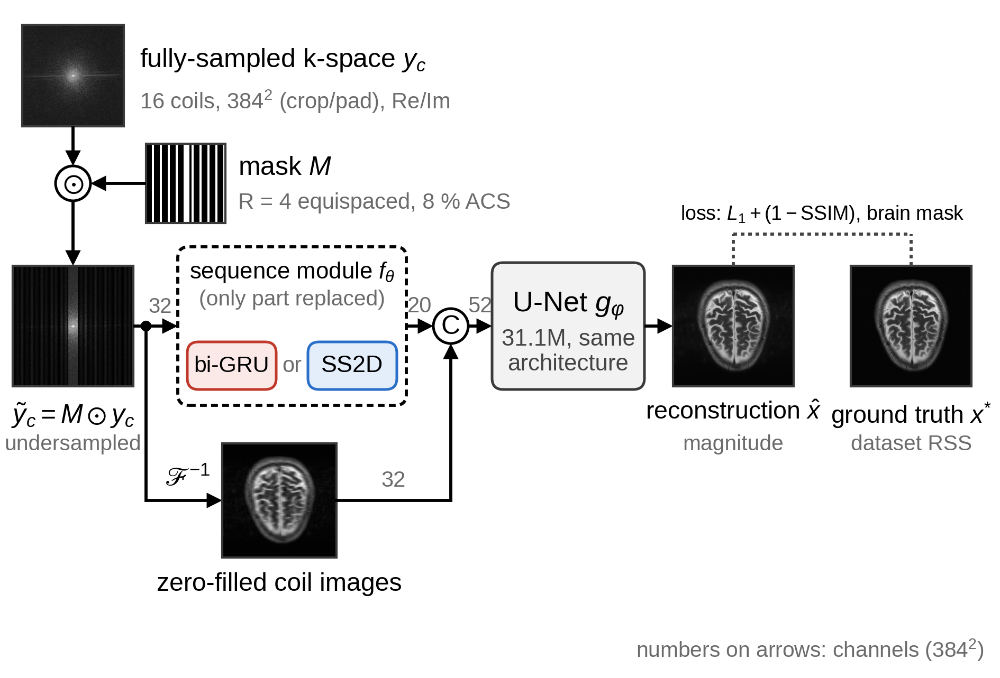
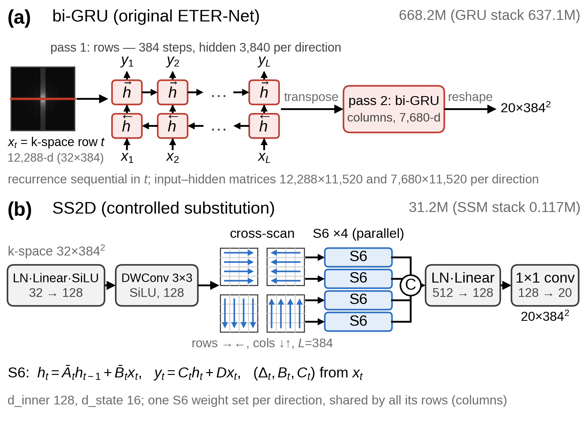
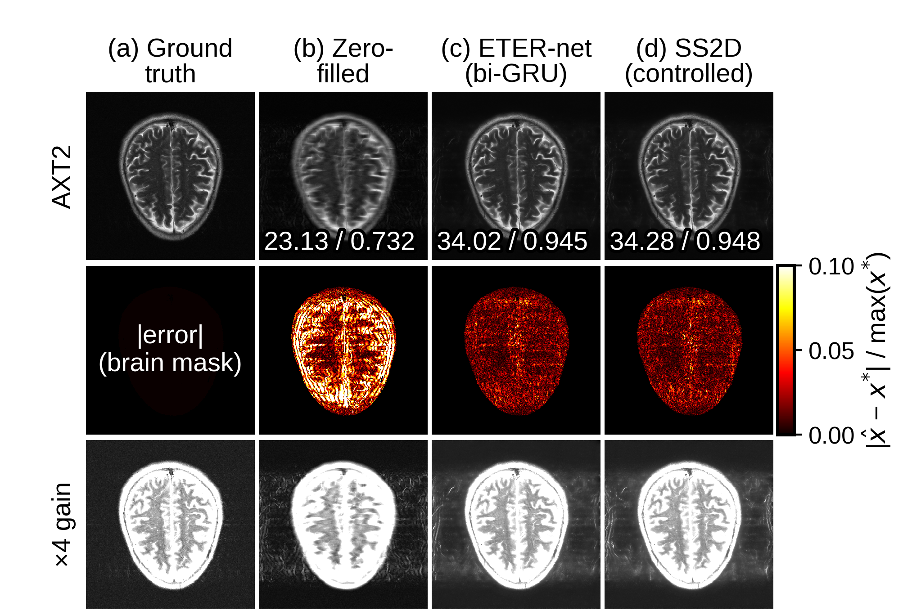

# 가속 MRI 재구성 네트워크 ETER-Net에서 순환신경망을 선택적 상태공간모델로 치환한 통제 연구

***, *** (*** 소속, e-mail : ***)

**A Controlled Study of Replacing RNN with a Selective SSM in ETER-Net for Accelerated Direct MRI**

*** and *** (*** University)

*(대한전자공학회 학술대회 2쪽 양식 — 작성예시 example_conference_2page.docx 기준; 저자·소속은 "***" 자리표시자)*

## Abstract

ETER-Net is an MRI reconstruction method that directly transforms undersampled k-space into the image domain using a bidirectional recurrent neural network (bi-RNN). This paper evaluates the effect of replacing the original bidirectional gated recurrent unit (bi-GRU) with a 2D selective state-space model (SS2D), treating the domain-transformation module as the single controlled variable. Both models are trained on the fastMRI brain multicoil dataset (384×384, R=4) and are identical in every component except the sequence model (same data, mask, U-Net architecture, loss, and optimization settings; trained independently without weight sharing); following the original paper, neither uses an explicit data-consistency (DC) block. Evaluation on the validation set (464 volumes/7,334 slices) shows that the SS2D replacement model, with 21× fewer parameters (31M vs. 668M), achieves a volume-level mean brain-masked SSIM of 0.9141 (bi-GRU: 0.9127) and PSNR of 33.91 dB (33.78 dB), outperforming the original bi-GRU design on all three main metrics (SSIM, PSNR, and nMSE). SS2D performs better on 78.2% (SSIM), 73.8% (PSNR), and 73.8% (nMSE) of slices and on 94.8% (SSIM), 89.9% (PSNR), and 90.1% (nMSE) of volumes (two-sided Wilcoxon signed-rank test at the volume level, p<0.001 for all three metrics). Qualitatively, in the presented example, the periodic ringing artifacts observed in the background outside the skull in the bi-GRU reconstruction are less pronounced in the SS2D reconstruction. Within the scope of a single training run on the fastMRI brain dataset at R=4, these results indicate that replacing the bi-GRU with SS2D in a direct domain-transformation architecture can yield quality gains even without a DC block and with substantially fewer parameters.

---

## Ⅰ. 서론

MRI는 k-space를 순차 수집하므로 촬영이 느리며, 언더샘플링 후의 딥러닝 재구성은 물리 모델의 반복 최적화를 펼치는 unrolled 계열[1]과 신경망이 k-space를 영상으로 직접 변환하는 도메인 변환 계열[2]로 나뉜다. ETER-Net[3]은 후자로, 양방향 GRU(gated recurrent unit, bi-GRU)가 k-space를 행·열 방향으로 읽어 영상 도메인 특징으로 변환하고 U-Net이 aliasing 아티팩트를 줄이며, 명시적 데이터 일관성(DC) 블록은 없다. 이후 non-Cartesian 궤적[4]과 ViT(Vision Transformer) 인코더 결합[5]으로 확장되었으나 도메인 변환의 핵심인 bi-RNN은 유지되었다. 그러나 bi-GRU는 순차 처리 방식이어서 스텝 간 병렬화가 어렵고, 행 전체를 한 스텝의 입력으로 펼치는 flatten-reshape 구조 때문에 파라미터가 수억 개에 이른다. 상태공간모델(SSM)에 입력 의존 선택 메커니즘을 더한 Mamba[6]는 순환을 병렬 스캔으로 선형 시간에 계산하고, 2차원 확장 SS2D[7]는 4방향 스캔으로 전역 수용영역을 얻는다. 기존의 Mamba 기반 MRI 재구성[8, 9]은 새로운 구조 전체를 제안하므로, 이들 연구만으로는 기존 골격에서 순환신경망만 SSM으로 치환했을 때의 효과를 분리해 평가하기 어렵다. 본 논문은 ETER-Net에서 도메인 변환 시퀀스 모델만 bi-GRU에서 SS2D로 치환하고 나머지를 모두 고정한 통제 비교를 보고하며, 통제를 해제한 강화 SS2D 변형의 결과도 함께 제시한다.

## Ⅱ. 방법

### 2.1 통제 파이프라인

그림 1 파이프라인의 입력은 완전 샘플링 k-space y_c(앞 16코일)에 가속률 R=4의 equispaced 언더샘플링 마스크 M(중앙 ACS(autocalibration signal) 영역 8%)을 곱한 ỹ_c=M⊙y_c를 실수·허수 채널로 분리한 (32, 384, 384) 텐서이다. 정답 x*는 데이터셋이 제공하는 전체 코일 RSS(root-sum-of-squares) 영상을 384×384로 crop/pad한 것이다. 시퀀스 모델 f_θ는 k-space를 영상 도메인 특징(20채널)으로 직접 변환한다. 이 특징을 같은 ỹ_c를 코일별로 역 FFT한 zero-filled 코일 영상(32채널)과 채널 방향으로 결합해 후처리 U-Net g_φ에 입력하면 magnitude 영상 x̂가 출력된다(식 (1)). g_φ는 원 ETER-Net 구현 그대로 dual-frame skip 연결, depth 5, 기저 64채널의 U-Net(파라미터 31.1M)이다.

$$ \hat{x} = g_{\phi}\left( \mathrm{concat}\left( f_{\theta}(\{\tilde{y}_c\}), \mathcal{F}^{-1}\{\tilde{y}_c\} \right) \right) \qquad (1) $$

비교 대상인 두 모델(이하 '비교 모델')은 f_θ 외의 데이터·마스크·손실·최적화·U-Net 구조가 동일하고, 가중치 공유 없이 각각 처음부터 독립적으로 학습하며, 원 논문[3]에 따라 DC 블록은 두지 않는다.

그림 1. 두 모델에 공통인 ETER-Net 통제 파이프라인 구성(점선 상자의 f_θ만 변수)

### 2.2 시퀀스 모듈의 두 구성과 강화 변형

그림 2(a)의 bi-GRU 모델은 원 ETER-Net 그대로 k-space를 384개 행의 시퀀스(스텝당 12,288차원)로 펼쳐 양방향 GRU를 통과시킨 뒤, 전치해 열 방향으로 한 번 더 통과시킨다. 두 GRU의 입력–은닉 행렬이 파라미터의 대부분을 차지하여 bi-GRU 스택만 637.1M, 모델 전체는 668.2M이다(원 코드에 있는 두 설정 중 방향당 은닉 3,840 = 384×10을 채택한 값이며, 다른 설정 384×12로는 880.5M이다). 또한 순환 연산은 스텝 순서대로만 계산되어 병렬화가 어렵다. 그림 2(b)의 SS2D 모델은 픽셀별 LN(layer normalization)·Linear(32→128)·SiLU와 depthwise conv를 거친 뒤, VMamba[7]와 같이 선택적 스캔(S6)을 네 방향(각 행 →/←, 각 열 ↓/↑, 시퀀스 길이 L=384)으로 적용하고 네 출력을 채널 방향으로 결합한 다음, LN·Linear와 1×1 conv로 bi-GRU와 같은 20채널로 맞춘다. S6[6]는 식 (2)와 같이 이산화한 상태공간 시스템의 파라미터 (Δ_t, B_t, C_t)를 매 스텝의 입력 x_t로부터 생성하는 입력 의존(선택적) 순환이다(h_t: 은닉 상태, y_t: 출력, Δ_t: 이산화 스텝 크기, A: 대각 상태 행렬, D: skip 계수). S6는 채널(d_inner=128)마다 독립적으로 적용되며, 상태 차원은 d_state=16이다.

$$ h_t = \exp(\Delta_t A)\, h_{t-1} + \Delta_t B_t x_t, \quad y_t = C_t h_t + D x_t \qquad (2) $$

방향별 한 조의 가중치를 그 방향의 모든 행(열)이 공유하므로 SS2D 스택은 0.12M(모델 전체 31.2M)에 그친다. 또한 S6의 순환은 순차 계산 대신 병렬 스캔으로 수행되어 시퀀스 길이 L에 선형인 O(L) 비용으로 계산된다. 표 1의 SS2D (controlled), 즉 앞서의 SS2D 치환 모델(이하 통제판)은 이렇게 출력 채널을 bi-GRU에 맞춘 위에 게이팅 없이 블록 하나만 두어, 용량이 bi-GRU를 넘지 않도록 한 최소 구성이다. 통제를 해제한 변형으로, Mamba 게이팅 y·SiLU(z)(z는 입력 투영의 게이트 분기)를 복원한 잔차 SS2D 블록 3개(d_inner 256, d_state 32, 출력 64채널)를 stride-3으로 다운샘플링한 특징 위에 쌓고 선택적 스캔을 fp16으로 수행하는 강화 SS2D(표 1의 Enhanced SS2D, 34.2M)도 두 모델의 50 epoch보다 긴 80 epoch 동안 학습하였다. 다만 이 변형은 구조·학습 epoch 수·파라미터화가 함께 바뀌므로 요소별 ablation은 수행하지 않았다.

그림 2. 시퀀스 모델 f_θ의 두 구성: (a) 원 bi-GRU, (b) SS2D

### 2.3 학습·평가 프로토콜

fastMRI brain multicoil[10] 공식 배포본 중 확보한 파일을 내용에 따른 선별 없이 공식 분할(train/val)대로 사용하였으며, 파일 손상으로 열리지 않는 train 파일 2개만 제외하였다. train 4,108 볼륨/65,028 슬라이스, val(검증 집합) 464 볼륨/7,334 슬라이스이고, contrast는 AXT1·AXT1POST·AXT1PRE·AXT2·AXFLAIR 혼합이다(val 볼륨의 58%가 AXT2). 전처리는 완전 샘플링 k-space를 역 FFT한 뒤 384×384로 crop/pad하고 다시 FFT하여 얻은 k-space에 마스크를 곱하는 retrospective 언더샘플링 프로토콜이다. 강도는 슬라이스별 정규화 없이 고정 배율(영상·정답 ×10⁶, k-space ×10⁴)을 적용하고, 코일은 앞 16개를 사용하되 16개 미만인 볼륨은 0으로 채운다. 학습 시 마스크 offset은 샘플마다 무작위로 두었고(val은 고정), 증강은 flip 후 FFT를 재계산하였다. 배경이 지표를 부풀리지 않도록 정답 x*에서 슬라이스마다 brain mask m(Otsu 임계×0.4 이상 화소의 최대 연결성분)을 만들어 손실(식 (3))과 지표를 그 내부에서만 계산하며, 같은 brain mask를 두 모델과 표 1의 공개 모델 평가에 동일하게 적용한다. SSIM_m은 SSIM 지도를 마스크 화소에서 평균한 값이며, 표 1과 이하 본문의 SSIM도 이 값을 뜻한다. SSIM 지도는 손실에서는 원 ETER-Net 코드의 구현(11×11 가우시안 창)으로, 평가에서는 scikit-image 구현(data_range = 마스크 내 x*의 최대−최소)으로 구하며, PSNR의 peak 값과 nMSE의 분모도 마스크 내부에서 취한다. 따라서 표 1의 수치는 전체 영상을 기준으로 산출하는 fastMRI 공식 평가 방식의 값과 직접 비교할 수 없다.

$$ \mathcal{L} = \frac{\sum_{i} m_i \left| \hat{x}_i - x^{*}_i \right|}{\sum_{i} m_i} + \left( 1 - \mathrm{SSIM}_m(\hat{x}, x^{*}) \right) \qquad (3) $$

학습은 Adam(학습률 2×10⁻⁴, weight decay 3×10⁻⁵)·cosine 스케줄(최소 1×10⁻⁶)·gradient clipping 1.0·자동 혼합정밀도(AMP)·batch 8 설정으로 TITAN RTX GPU 1개에서 난수 시드를 고정하지 않은 단일 런으로 수행하였으며, 학습 epoch 수는 두 모델이 50(검증 매 2 epoch), 강화 SS2D만 80이었다. 지표로는 SSIM(주지표)·PSNR·nMSE(%)를 슬라이스 단위로 계산한 뒤 fastMRI 관례대로 볼륨별로 평균하여 볼륨 단위 평균±표준편차로 보고하였고, 같은 슬라이스에서 두 모델을 비교하는 paired 설계이므로 슬라이스·볼륨 단위 우위 비율과 볼륨 단위 양측 Wilcoxon signed-rank 검정, 볼륨 클러스터 부트스트랩(2,000회) 95% 신뢰구간(CI)으로 유의성을 평가하였다.

## Ⅲ. 실험 결과

### 3.1 정량 비교

표 1에서 본 연구의 세 학습 모델 수치는 각 런의 best checkpoint(bi-GRU epoch 50, SS2D epoch 48, 강화 SS2D epoch 78)의 결과이며, checkpoint 선택과 결과 보고에 같은 검증 집합을 사용하였다(fastMRI 관례대로 별도의 내부 test 분할은 두지 않았다). SS2D 치환 모델은 21배 적은 파라미터로 세 지표 전부에서 원 bi-GRU 설계를 상회하였다. 슬라이스 단위 paired 비교에서 SS2D의 우위 비율은 SSIM 78.2%(95% CI 76.8~79.7%), PSNR 73.8%, nMSE 73.8%였고, 볼륨 단위로는 각각 94.8%, 89.9%, 90.1%였다(모든 지표에서 p<0.001). 슬라이스 단위 ΔSSIM의 평균은 +0.0014(95% CI +0.0013~+0.0015)였다. 학습 로그의 25회 검증 시점 전부에서 SS2D의 검증 SSIM이 bi-GRU 이상이었고(동률 1회) PSNR은 25회 모두 상회하였다. 또한 5개 contrast 서브그룹 전부에서도 우위가 유지되었다(서브그룹과 세 지표를 통틀어 우위 슬라이스 비율의 최솟값 68.7%). 다만 epoch당 학습 시간은 cuDNN 커널로 최적화된 bi-GRU 쪽이 짧아(2.41 h 대 3.07 h), 본 구현에서 SS2D의 효율 이점은 학습 시간이 아니라 파라미터 수에 있다. 강화 SS2D는 통제판 대비 세 지표 모두에서 우위 슬라이스 비율이 54~56%(p<0.001)로 근소한 이득을 보였으나, 평균 nMSE는 통제판이 더 낮았다(0.438% 대 0.439%). 이 이득은 50 epoch 이후 80 epoch까지 연장한 학습 구간에서 얻은 것으로, 50 epoch 시점의 학습 로그 검증 SSIM(슬라이스 단위)은 강화 SS2D 0.9130 대 통제판 0.9138이었다.

표 1. fastMRI brain 검증 집합 전체(464 볼륨/7,334 슬라이스, R=4, brain-masked)의 볼륨 단위 결과(평균±표준편차)

| Method | Params (M) | SSIM ↑ | PSNR (dB) ↑ | nMSE (%) ↓ |
|---|---|---|---|---|
| Zero-filled | – | 0.7523±0.0410 | 24.76±2.11 | 3.935±2.166 |
| bi-GRU (original) | 668 | 0.9127±0.0366 | 33.78±1.86 | 0.448±0.274 |
| SS2D (controlled) | 31 | <u>0.9141±0.0365</u> | <u>33.91±1.90</u> | **0.438±0.283** |
| Enhanced SS2D | 34 | **0.9146±0.0361** | **33.92±1.90** | <u>0.439±0.304</u> |
| U-Net† | 496 | 0.8971±0.0366 | 30.95±2.29 | 0.973±0.796 |
| E2E-VarNet† | 30 | 0.9181±0.0386 | 32.78±3.21 | 1.133±1.291 |
| PromptMR+ | 93 | 0.9417±0.0349 | 36.12±4.02 | 0.526±0.841 |

위 네 행 = 본 연구에서 직접 산출한 값이며, 굵게·밑줄은 이 네 행 안에서의 최고값·차선을 뜻한다. Zero-filled: 마스크된 k-space를 역 FFT한 코일 영상의 RSS. 아래 세 행 = 공개 가중치를 본 연구 프로토콜(384×384 재-FFT·16코일·R=4)로 CPU fp32에서 추론한 참고선: 본 프로토콜이 각 모델의 원 학습 조건과 달라 도메인 시프트가 있고 brain mask 내 슬라이스별 최소제곱 강도 정합을 공개 모델에만 적용하였으므로 우열 판정에서 제외. †: fastMRI leaderboard 가중치(본 검증 집합을 포함한 train+val로 학습). PromptMR+: train 분할만으로 학습, 12-cascade unrolled 모델, 인접 5슬라이스 입력.

### 3.2 정성 비교와 참고선

그림 3은 검증 집합에서 사전에 고정한 점검 슬라이스 12개 중 한 장(AXT2)을 보인다. 위 행은 재구성(정답·zero-filled·bi-GRU·SS2D 순, 패널 안 수치는 해당 슬라이스의 PSNR/SSIM), 가운데 행은 brain-masked 오차 지도, 아래 행은 밝기를 4배 올려 배경의 저강도 아티팩트를 드러낸 ×4 gain 영상이다. 오차 지도와 패널 수치에서 SS2D의 잔차가 다소 작고, gain 영상에서는 두개골 바깥 배경의 주기적 ringing 아티팩트가 bi-GRU 재구성에서 두드러지는 반면 SS2D 재구성에서는 덜 두드러진다. brain mask 밖의 이러한 아티팩트는 표 1의 지표에 반영되지 않으며 별도로 정량화하지는 않았다. 표 1 하단의 U-Net†[10]·E2E-VarNet†[1]·PromptMR+[11]는 표 1 주석에 적은 조건에서 추론한 참고선이며, 학습 데이터·조건이 달라 본 연구 모델과의 우열 판정에는 사용하지 않는다.

그림 3. 검증 슬라이스(AXT2) 정성 비교: 재구성(위), brain-masked 오차(가운데), ×4 gain(아래)

## Ⅳ. 결론

본 연구는 ETER-Net의 도메인 변환 모듈에서 bi-GRU를 SS2D로 치환하여, DC 블록 없이 21배 적은 파라미터로 표준 지표(SSIM·PSNR·nMSE) 평균 전부에서 원 설계를 상회하고 대다수 슬라이스·볼륨에서도 우위를 얻었으며, 제시한 정성 예시에서는 배경 ringing 아티팩트도 덜 두드러졌다. 이 결론은 ‘SSM이 RNN보다 우월하다’는 일반론이 아니라 ‘SS2D 치환이 원 bi-GRU 설계보다 낫다’로 한정된다. 본 연구의 한계는 다음 세 가지이다. 첫째, 두 모델이 순환 메커니즘과 파라미터화 모두에서 달라 각 요인의 기여를 분리하지 못하였다. 둘째, f_θ 없이 g_φ만 학습한 기준선(baseline)을 두지 않아 f_θ 자체의 기여 크기는 평가하지 못하였다. 셋째, 시드를 고정하지 않은 단일 런, 단일 데이터셋(AXT2 편중), 단일 가속률(R=4)로 검증 범위가 제한된다. 이러한 한계를 보완하기 위해 멀티시드 재현, Transformer 모델과 SS2D처럼 스캔 위치 간 가중치를 공유해 경량화한 pixel-GRU 모델의 추가, 가속률 일반화 학습을 진행하고 있다.

## 참고문헌

[1] A. Sriram et al., "End-to-End Variational Networks for Accelerated MRI Reconstruction," in *Proc. MICCAI*, LNCS, Vol. 12262, pp. 64-73, 2020.  
[2] B. Zhu, J. Z. Liu, S. F. Cauley, B. R. Rosen, and M. S. Rosen, "Image reconstruction by domain-transform manifold learning," *Nature*, Vol. 555, pp. 487-492, 2018.  
[3] C. Oh, D. Kim, J.-Y. Chung, Y. Han, and H. Park, "A k-space-to-image reconstruction network for MRI using recurrent neural network," *Med. Phys.*, Vol. 48, no. 1, pp. 193-203, 2021.  
[4] C. Oh, J.-Y. Chung, and Y. Han, "An End-to-End Recurrent Neural Network for Radial MR Image Reconstruction," *Sensors*, Vol. 22, no. 19, Art. no. 7277, 2022.  
[5] C. Oh, "A Hybrid Vision Transformer-BiRNN Architecture for Direct k-Space to Image Reconstruction in Accelerated MRI," *J. Imaging*, Vol. 12, no. 1, Art. no. 11, 2025.  
[6] A. Gu and T. Dao, "Mamba: Linear-Time Sequence Modeling with Selective State Spaces," arXiv preprint arXiv:2312.00752, 2023.  
[7] Y. Liu et al., "VMamba: Visual State Space Model," in *Proc. NeurIPS*, 2024.  
[8] Y. Korkmaz and V. M. Patel, "MambaRecon: MRI Reconstruction with Structured State Space Models," in *Proc. IEEE/CVF WACV*, 2025.  
[9] J. Huang et al., "Enhancing global sensitivity and uncertainty quantification in medical image reconstruction with Monte Carlo arbitrary-masked Mamba," *Med. Image Anal.*, Vol. 99, Art. no. 103334, 2025.  
[10] J. Zbontar et al., "fastMRI: An Open Dataset and Benchmarks for Accelerated MRI," arXiv preprint arXiv:1811.08839, 2018.  
[11] B. Xin, M. Ye, L. Axel, and D. N. Metaxas, "Rethinking Deep Unrolled Model for Accelerated MRI Reconstruction," in *Proc. ECCV*, LNCS, Vol. 15133, pp. 164-181, 2024.  
