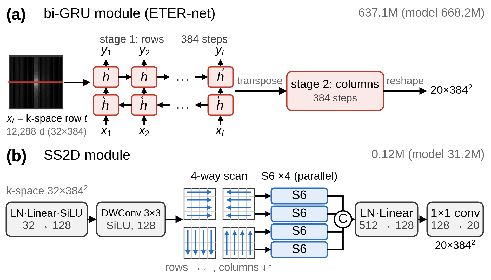

# 가속 MRI 재구성 네트워크 ETER-Net에서 순환신경망을 선택적 상태공간모델로 치환한 통제 비교 연구

**A Controlled Study of Replacing the RNN with a Selective SSM in ETER-Net for Accelerated MRI Reconstruction**

*(대한전자공학회 투고용 논문 양식 2021 — 저자·소속은 투고 시스템/게재용 양식에서 기입)*

## 요 약

ETER-net은 언더샘플링된 k-space를 양방향 순환신경망(bi-RNN)을 활용하여 영상 도메인으로 직접 변환하는 MRI 재구성 방법이다. 본 연구는 ETER-net의 도메인 변환 모듈을 제외한 구조와 학습 설정을 동일하게 유지하고, 양방향 GRU(gated recurrent unit, bi-GRU) 모듈을 2차원 선택적 상태공간모델(SS2D)로 교체하였을 때의 재구성 성능을 비교한다. fastMRI brain multicoil 데이터셋(384×384, R=4)에서 두 모델은 도메인 변환 모듈을 제외하면 데이터, 언더샘플링 마스크, U-Net 구조, 손실 함수, 최적화 설정이 모두 동일하며, 가중치 공유 없이 각각 독립적으로 학습되었고, 기존 ETER-net 설계와 동일하게 명시적 데이터 일관성(DC) 블록을 포함하지 않는다. SS2D(controlled) 모델은 시퀀스 모듈만 ETER-net과 다르며, 파라미터 수는 ETER-net의 약 1/21(31M 대 668M)이다. 두 모델은 50 epochs 학습을 난수 시드를 고정하지 않은 1회차(run 1)와 난수 시드를 고정한 2회차(run 2)로 각각 두 번 수행하였다. brain mask 내부에서 계산한 볼륨 평균 SSIM의 차이(SS2D(controlled)의 값에서 ETER-net의 값을 뺀 값)는 1회차에서 +0.0014(0.9141 대 0.9127), 2회차에서 −0.0003(0.9133 대 0.9136)이었다. 볼륨 단위 대응 Wilcoxon signed-rank 검정에서 두 회차의 차이는 모두 유의하였으나($p<0.001$) 방향은 서로 반대였고, 학습 기간을 25 epochs로 줄인 단축 학습의 세 가지 난수 시드에서도 차이의 부호가 일정하지 않았다. 따라서 두 모델의 차이는 학습 회차 간 변동과 구분되지 않았다. 시퀀스 모듈을 제거하고 그 출력을 0으로 대체한 U-Net 단독 모델의 볼륨 평균 SSIM은 0.9127로 위 네 학습 결과(0.9127~0.9141)와 비슷한 수준이었으며, 이는 R=4 조건에서 다중 코일 zero-filled 영상을 함께 입력받는 U-Net에 시퀀스 모듈이 더하는 기여가 작음을 시사한다. 이 조건에서는 bi-GRU 모듈을 SS2D 모듈로 교체하여 전체 파라미터 수를 약 1/21로 줄여도 학습 회차 간 변동을 넘는 재구성 품질 저하가 나타나지 않았다.

## Abstract

ETER-net is an MRI reconstruction method that directly transforms undersampled k-space into the image domain using a bidirectional recurrent neural network (bi-RNN). This study evaluates the effect of replacing the bidirectional gated recurrent unit (bi-GRU) module in ETER-net with a two-dimensional selective state-space model (SS2D), while keeping the remaining architecture and training settings unchanged. Experiments are conducted on the fastMRI brain multicoil dataset at an image size of 384×384 and an acceleration factor of R=4. Both models use the same data, undersampling masks, U-Net architecture, loss function, and optimization settings. They are trained independently without weight sharing, and neither includes an explicit data-consistency (DC) block, consistent with the original ETER-net design. The SS2D(controlled) model differs from ETER-net only in the sequence module and uses approximately 1/21 of its parameters (31M vs. 668M). Both models were trained twice for 50 epochs, without (run 1) and with (run 2) a fixed random seed. The difference in volume-averaged SSIM computed within a brain mask (SS2D(controlled) minus ETER-net) was +0.0014 in run 1 (0.9141 vs. 0.9127) and −0.0003 in run 2 (0.9133 vs. 0.9136). The paired volume-level Wilcoxon signed-rank test was significant in both runs ($p<0.001$) but in opposite directions, and the sign also varied across three random seeds in shortened 25-epoch training; thus the difference between the two models could not be distinguished from run-to-run training variation. A U-Net-only model, in which the sequence module was removed and its output replaced with zeros, achieved a volume-averaged SSIM of 0.9127, comparable to the four runs above (0.9127–0.9141), suggesting that at R=4 the sequence module adds little to the U-Net, which also receives the multi-coil zero-filled image. In this setting, replacing the bi-GRU module with the SS2D module, which reduces the total number of parameters to about 1/21, did not degrade reconstruction quality beyond run-to-run variation.

**Keywords :** MRI reconstruction, accelerated MRI, ETER-net, recurrent neural network, selective state-space model, SS2D, controlled comparison

---

## Ⅰ. 서론

MRI는 k-space를 순차적으로 수집하므로 촬영 시간이 길다. 촬영 시간을 단축하기 위해 언더샘플링된 k-space로부터 영상을 복원하는 딥러닝 기법이 연구되어 왔다. 대표적인 접근으로는 물리 모델 기반 반복 최적화 과정을 신경망 층으로 펼치는 방식(unrolling)[1]과 k-space를 영상으로 직접 변환하는 도메인 변환 방식[2]이 있다. ETER-net[3]은 후자에 속한다. 양방향 GRU(gated recurrent unit, bi-GRU)가 k-space를 행·열 방향으로 읽어 영상 도메인 특징으로 변환하고 U-Net이 에일리어싱(aliasing) 아티팩트를 줄이며, 명시적 데이터 일관성(DC) 블록은 사용하지 않는다. 이후 non-Cartesian 궤적[4]과 Vision Transformer(ViT) 인코더 결합[5]으로 확장되었으나 도메인 변환의 핵심인 bi-RNN은 유지되었다. 그러나 ETER-net은 행·열 방향을 순차 처리하는 구조여서 병렬화가 어렵고, flattened 2D 고차원 입력을 GRU로 처리하므로 대규모 가중치 행렬이 필요하며, 전체 파라미터 수가 수억 개에 이른다. 선택적 상태공간모델(SSM)인 Mamba[6]는 입력 의존 순환을 병렬 스캔으로 선형 시간에 계산하고, 이를 2차원으로 확장한 SS2D[7]는 선택적 스캔을 여러 방향으로 적용하여 2차원 공간 정보를 처리한다. 기존의 Mamba 기반 MRI 재구성[8, 9]은 새로운 구조 전체를 제안하므로, 기존 골격에서 순환신경망만 SSM으로 바꾼 효과를 분리하여 평가할 수 없다. 본 논문은 ETER-net에서 도메인 변환을 담당하는 시퀀스 모듈만 bi-GRU에서 SS2D로 치환하고, 나머지는 모두 고정한 상태에서 통제 비교 분석을 수행한다.

## Ⅱ. 방법

### 1. 비교 실험의 공통 재구성 파이프라인

그림 1의 파이프라인에서는 완전 샘플링된(fully-sampled) k-space $y_c$에 가속화 계수가 4인(R=4) 등간격(equispaced) 마스크 $M$을 적용하여, 언더샘플링된 k-space $\tilde{y}_c$($=M \odot y_c$, $\odot$는 원소별 곱)를 생성한다. 이 마스크는 k-space 중앙 8%의 auto-calibration signal(ACS) 라인을 모두 포함한다. 이를 실수·허수로 분리한 32채널 텐서를 모델의 입력으로 사용한다. 한편, 참조 영상(Ground Truth, GT) $x^{*}$는 데이터셋이 제공하는 전체 코일 RSS(Root-Sum-of-Squares) 영상을 384×384 크기로 크롭 및 패딩하여 생성한다. 시퀀스 모듈 $f_\theta$는 입력 k-space를 영상 도메인 특징(20채널)으로 직접 변환한다. 동일한 $\tilde{y}_c$에 코일별 역 푸리에 변환을 적용한 zero-filled 영상(32채널)과 앞서 생성된 영상 도메인 특징을 채널 축으로 결합한다. 후처리를 담당하는 U-Net $g_\phi$이 결합 텐서를 입력으로 하여 최종 결과인 크기(magnitude) 영상 $\hat{x}$을 출력한다(식 (1)). 실험에 사용한 U-Net은 dual-frame skip을 포함하며, 깊이가 5, 첫 단계의 채널 수가 64이고, 파라미터의 수는 31.1M이다.

$$ \hat{x} = g_{\phi}\left( \mathrm{concat}\left( f_{\theta}(\{\tilde{y}_c\}), \mathcal{F}^{-1}\{\tilde{y}_c\} \right) \right) \qquad (1) $$

식 (1)에서 $\{\tilde{y}_c\}$는 모든 코일($c$는 코일 인덱스)의 언더샘플링된 k-space, $\mathcal{F}^{-1}$는 코일별 2차원 역 푸리에 변환, $\mathrm{concat}$은 두 텐서를 채널 축으로 결합하는 연산이며, $\theta$와 $\phi$는 각각 $f_\theta$와 $g_\phi$의 학습 파라미터이다. 이하 두 비교 모델은 시퀀스 모듈 $f_\theta$만 서로 다르다. 두 모델은 가중치 공유 없이 각각 처음부터 독립적으로 학습되었고, 원 논문[3]과 같이 명시적 DC 블록을 포함하지 않는다.

Fig. 1. Common ETER-net pipeline of the two compared models (without weight sharing), where only the sequence module $f_\theta$ (dashed box) differs

### 2. 시퀀스 모듈의 두 구성

ETER-net의 bi-GRU 모듈은 그림 2(a)에 나타나듯이, 입력 k-space를 384개 행의 시퀀스(스텝당 12,288차원)로 펼쳐 양방향 GRU를 통과시킨 뒤, 전치하여 열 방향으로 한 번 더 통과시키는 구조이다. 두 GRU의 입력–은닉 행렬이 파라미터의 대부분을 차지하여 bi-GRU 모듈의 파라미터의 수가 637.1M, 모델의 전체 파라미터의 수가 668.2M이다. 그림 2(b)는 SS2D[7] 모듈을 나타낸다. 이 모듈은 먼저 각 k-space 위치의 32채널 벡터에 층 정규화(Layer Normalization, LN), 선형 층 Linear(32 to 128), SiLU(Sigmoid Linear Unit) 활성화 함수를 차례로 적용한 뒤, 3×3 depthwise convolution과 SiLU로 이웃 위치의 정보를 혼합한다. 이어서 각 행에 대해서는 좌우 두 방향, 각 열에 대해서는 상하 두 방향으로 S6를 적용하여 선택적 스캔을 수행한다. S6는 Mamba[6]에서 정의한 구조로, 구조화 상태 공간 시퀀스 모델(S4)에 입력에 따라 계수가 달라지는 선택(selection) 메커니즘을 더하고 스캔(scan) 알고리즘으로 계산한다. 제안 방법은 384 길이의 각 행과 열을 독립 시퀀스로 처리하며, 각 방향에 대해 독립된 가중치를 적용한다. 마지막으로 이 모듈은 네 방향의 출력에 대해 채널 축으로 결합한 512채널 특징에 LN, Linear(512 to 128), 1×1 convolution(128 to 20)을 차례로 적용하여 bi-GRU 모듈의 출력과 같은 20채널의 영상 도메인 특징을 생성한다. S6는 한 행 또는 한 열의 시퀀스를 식 (2)의 이산화된 상태 공간 시스템으로 처리한다.

$$ h_t = \exp(\Delta_t A)\, h_{t-1} + \Delta_t B_t x_t, \quad y_t = C_t h_t + D x_t \qquad (2) $$

식 (2)에서 아래첨자 $t$는 스캔 방향을 따라 부여한 시퀀스 내 위치($t = 1, \ldots, L$, 시퀀스 길이 $L=384$)를 의미한다. $x_t$와 $y_t$는 위치 $t$의 입력과 출력이고, $h_t$와 $h_{t-1}$은 각각 위치 $t$와 $t-1$까지의 입력을 요약한 $N$차원($N=16$) 은닉 상태 벡터이다. $A$는 학습 가능한 $N \times N$ 대각 상태 행렬이고, $\exp(\Delta_t A)$는 $A$를 간격 $\Delta_t$로 이산화한 상태 전이 행렬이다. $B_t$와 $C_t$는 은닉 상태와 같은 $N$차원($N=16$) 벡터로, 각각 입력을 은닉 상태에 반영하는 계수와 은닉 상태로부터 출력을 계산하는 계수이다. $D$는 입력 $x_t$에 곱해져 출력에 직접 더해지는 skip 계수이다. 식 (2)는 Linear(32 to 128) 이후의 128개 내부 채널 각각에 독립적으로 적용되므로, $x_t$와 $y_t$는 한 채널의 스칼라 값이고 $A$와 $D$는 채널마다 따로 학습된다. $\Delta_t$, $B_t$, $C_t$는 위치 $t$에서 128개 채널의 입력을 모은 벡터를 선형 층에 통과시켜 얻은 값이다. 이때 $\Delta_t$는 softplus 함수를 거친 채널별 양수이고, $B_t$와 $C_t$는 모든 채널에 공통이다.

bi-GRU 모듈은 한 스텝의 입력이 한 행 전체를 펼친 12,288차원 벡터이고 은닉 상태가 3,840차원이어서 입력–은닉 행렬이 매우 크다. 반면 SS2D 모듈은 각 k-space 위치의 32채널 벡터를 128채널로 바꾼 뒤 위치마다 같은 작은 계수로 스캔하므로, 시퀀스 모듈의 파라미터 수가 0.12M에 그친다. 본 논문에서 제안하는 SS2D 기반 방법 중, SS2D(controlled)는 SS2D 모듈 하나만을 시퀀스 모듈로 구성한 방법(전체 파라미터 수 31.2M)이고, SS2D(enhanced)는 잔차 연결로 쌓은 SS2D 블록 3개(내부 채널 256개, $N=32$)와 64채널 출력 층을 시퀀스 모듈로 구성한 방법(전체 파라미터 수 34.2M)이다. SS2D(enhanced)의 시퀀스 모듈은 입력을 stride 3의 합성곱 층으로 128×128로 줄이고, 16비트 부동소수점(fp16) 정밀도로 스캔을 수행한 뒤 업샘플링을 통해 원래 크기로 되돌린다. 각 SS2D 블록은 256채널 입력을 선형 층으로 512채널로 바꾼 뒤 두 갈래(각 256채널)로 나누고, 한 갈래에 SiLU를 적용한 값을 다른 갈래의 스캔 출력에 원소별로 곱하는 Mamba의 게이팅을 수행한다. SS2D(controlled)는 ETER-net과 같은 학습 조건으로 학습하였고, SS2D(enhanced)는 학습 epoch 수(80) 등 일부 학습 설정을 달리하여 학습하였다. 학습 조건의 각 요소에 대한 절제 실험(ablation study)은 수행하지 않았다.

Fig. 2. Two configurations of the sequence module $f_\theta$: (a) bi-GRU module of ETER-net, (b) SS2D module

### 3. 학습·평가 프로토콜

학습에 사용한 데이터셋은 fastMRI brain multicoil 데이터셋[10]의 공식 학습 분할에서 확보한 볼륨 중 손상된 2개를 제외한 4,108개 볼륨(슬라이스 65,028개)이며, 검증은 공식 검증 분할의 첫 번째 배포 묶음(batch 0)에 속한 464개 볼륨(슬라이스 7,334개)을 사용하였다. 데이터셋은 축상면(axial) T1, 조영제 투여 전후 T1, T2, FLAIR 영상이 혼합되어 있으며, 검증 데이터셋의 58%는 축상면 T2 영상(AXT2)이다. 불규칙한 데이터 크기를 맞추기 위한 전처리 과정으로 각 데이터의 완전 샘플링된 k-space를 영상으로 변환한 뒤, 각 코일별로 384×384 크기로 크롭 및 패딩한 다음 다시 k-space로 변환하는 과정을 통해 $y_c$를 시뮬레이션하였다. 슬라이스별 강도 정규화 대신 zero-filled 영상과 참조 영상에는 $10^{6}$, k-space에는 $10^{4}$의 고정 배율을 곱하였다. 코일 수는 16개로 통일하여, 코일이 16개보다 많은 데이터는 처음 16개 코일만 사용하고 16개보다 적은 데이터는 부족한 채널을 0으로 채웠다. 등간격 샘플링 라인의 시작 위치(mask offset)는 학습 시에는 샘플마다 무작위로 정하였고, 검증 시에는 고정하였다. 학습 데이터셋에 대해서는 영상을 상하와 좌우로 각각 무작위로 반전한 뒤 k-space를 다시 계산하여 데이터를 증강하였다. Otsu 방법[11]은 화소 강도 히스토그램을 두 집단으로 나눌 때 집단 간 분산이 최대가 되는 임곗값을 구한다. 배경 영역의 영향을 줄이기 위해 슬라이스마다 참조 영상 $x^{*}$의 0이 아닌 화소로부터 Otsu 임곗값 $T$를 구하고, $x^{*} > 0.4T$를 만족하는 화소들의 연결 성분 중 가장 큰 것을 brain mask $m$으로 정의하였다. 학습에 사용한 손실 함수(식 (3))와 세 평가 지표인 structural similarity index(SSIM), peak signal-to-noise ratio(PSNR), normalized mean squared error(nMSE)는 모두 이 마스크 내부에서만 계산하였고, 표 1의 모든 결과에 같은 마스크를 적용하였다. 손실에는 SSIM 손실을 사용하였고, 평가 SSIM은 scikit-image 구현으로 구하여 마스크 내부에서 평균하였다. 평가 SSIM의 동적 범위(data range)는 마스크 내부 $x^{*}$의 최댓값과 최솟값의 차이로 정하였고, PSNR의 최대 신호 값(peak, $x^{*}$의 최댓값)과 nMSE의 분모($x^{*}$의 제곱합)도 마스크 내부에서 구하였다.

$$ \mathcal{L} = \frac{\sum_{i} m_i \left| \hat{x}_i - x^{*}_i \right|}{\sum_{i} m_i} + \left( 1 - \mathrm{SSIM}_m(\hat{x}, x^{*}) \right) \qquad (3) $$

식 (3)에서 $\mathcal{L}$은 손실 함수, $i$는 화소 인덱스, $\sum_{i}$는 모든 화소에 대한 합이다. $m_i$는 화소 $i$가 brain mask $m$ 내부이면 1, 외부이면 0이고, $x^{*}_i$와 $\hat{x}_i$는 각각 화소 $i$에서의 참조 영상 $x^{*}$와 재구성 영상 $\hat{x}$의 값이다. $\mathrm{SSIM}_m(\hat{x}, x^{*})$는 두 영상의 SSIM 지도를 마스크 $m$ 내부에서 평균한 값이며, 아래 첨자 $m$은 이 마스크를 나타낸다. 두 항은 가중치 1로 더하였으며, 첫째 항은 고정 배율($10^{6}$)을 곱한 강도 값으로 계산하였다. 최적화에는 Adam(weight decay $3\times10^{-5}$)을 사용하였고, 학습률은 $2\times10^{-4}$에서 시작하여 cosine annealing으로 최소 $1\times10^{-6}$까지 감소시켰다. 배치 크기는 8, gradient norm의 상한은 1.0이며, 자동 혼합 정밀도 학습을 사용하였다. ETER-net과 SS2D(controlled)는 50 epochs 학습을 각각 두 번, SS2D(enhanced)는 80 epochs 학습을 한 번 수행하였고, 검증은 2 epoch마다 수행하였다. 1회차 학습(run 1)에서는 난수 시드를 고정하지 않았고, 2회차 학습(run 2)에서는 난수 시드를 1로 고정하여 두 모델이 같은 순서의 학습 데이터와 같은 무작위 반전·mask offset을 사용하도록 하였다. 2회차에서는 데이터 로더 작업자(worker)별 난수 스트림도 분리하였다. 학습 회차 간 변동을 추가로 확인하기 위하여, 학습 기간을 25 epochs로 줄인 단축 학습도 난수 시드 0, 1, 2로 모델별 세 번 수행하고 24번째 epoch의 학습 중 검증 SSIM(슬라이스 평균)을 비교하였다. 또한 시퀀스 모듈의 기여를 확인하기 위하여, 시퀀스 모듈의 출력 20채널을 0으로 대체한 U-Net 단독 모델(U-Net only)을 구성하였다. 이 모델의 U-Net은 다른 모델과 구조와 입력 채널 수가 같지만 실제로는 zero-filled 영상(32채널)만을 입력 정보로 받으며, 2회차와 같은 조건(난수 시드 1, 50 epochs)으로 처음부터 학습하였다. epoch당 학습 시간(1회차 학습 기준, 검증 포함, TITAN RTX 1대)은 ETER-net 2.41 h, SS2D(controlled) 3.07 h, SS2D(enhanced) 2.84 h였다. 최적 체크포인트는 검증 집합에서 구한 SSIM, dB 단위의 PSNR을 40으로 나눈 값, 1에서 nMSE를 뺀 값을 각각 0.5, 0.3, 0.2의 가중치로 더한 선택 점수가 최대인 체크포인트로 사용하였다. 각 지표는 슬라이스별로 계산하여 볼륨마다 평균한 뒤, 볼륨별 평균값 464개의 평균과 표준편차로 계산하였다. 또한 두 모델을 같은 슬라이스(또는 볼륨)끼리 짝지어, 한 모델의 지표가 다른 모델보다 우수한 슬라이스와 볼륨의 비율(우위 비율)을 지표별로 계산하였다. 유의성은 볼륨 단위 양측 Wilcoxon signed-rank 검정으로 평가하였다.

## Ⅲ. 실험 결과

### 1. 정량 평가

표 1은 최적 체크포인트(ETER-net: run 1·run 2 모두 50 epochs, SS2D(controlled): run 1 48 epochs·run 2 50 epochs, SS2D(enhanced): 78 epochs, U-Net only: 50 epochs)를 검증 집합 전체에 적용한 결과이다. fastMRI의 테스트(test) 분할은 참조 영상이 공개되지 않으므로 검증 집합을 평가에 사용하였다. 체크포인트 선택에도 같은 검증 집합을 사용하였으므로 수치가 다소 낙관적일 수 있으며, 선택된 체크포인트는 모두 학습 막바지(48~50번째 epoch, SS2D(enhanced)는 78번째 epoch)였다. 1회차 학습에서는 SS2D(controlled)의 볼륨 평균 SSIM이 ETER-net보다 0.0014 높았고(0.9141 대 0.9127), 2회차 학습에서는 0.0003 낮았다(0.9133 대 0.9136). 볼륨 단위 양측 Wilcoxon signed-rank 검정에서 두 회차의 차이는 모두 유의하였으나($p<0.001$) 방향은 서로 반대였다. 이 검정은 학습이 끝난 한 쌍의 모델에 대하여 검증 볼륨에 따른 변동만 반영하며, 학습을 다시 수행할 때 생기는 변동은 반영하지 않는다. 같은 모델을 다시 학습하였을 때의 SSIM 차이(ETER-net 0.0009, SS2D(controlled) 0.0008)는 두 회차의 모델 간 차이와 같은 크기 수준이었고, 25 epochs 단축 학습의 세 시드에서도 차이의 부호가 일정하지 않았다. 따라서 두 모델의 SSIM 차이는 학습 회차 간 변동과 구분되지 않았으며, SS2D(controlled)는 ETER-net의 약 1/21의 파라미터로 ETER-net과 비슷한 수준의 재구성 성능을 보였다. 시퀀스 모듈을 제거한 U-Net 단독 모델의 볼륨 평균 SSIM은 0.9127이었다. 같은 순서의 학습 데이터로 학습한 2회차의 ETER-net과 SS2D(controlled)는 U-Net 단독 모델보다 볼륨 평균 SSIM이 각각 0.0010, 0.0006 높았다(모두 $p<0.001$). 1회차 ETER-net과 U-Net 단독 모델의 SSIM 차이는 0.0001 미만으로 유의하지 않았으나($p=0.33$), PSNR과 nMSE에서는 ETER-net이 유의하게 우수하였다($p<0.01$). 1회차 SS2D(controlled)는 U-Net 단독 모델보다 SSIM이 0.0015 높았다($p<0.001$). 즉 ETER-net과 SS2D(controlled)에서 시퀀스 모듈 유무에 따른 SSIM 차이는 0.0015 이하로, 같은 모델의 학습 회차 간 차이(0.0008~0.0009)와 같은 크기 수준이었다. 다만 U-Net 단독 모델은 한 번만 학습하였으므로 이 모델의 학습 회차 간 변동은 추정하지 못하였다. SS2D(enhanced)와 1회차 SS2D(controlled)의 대응(paired) 비교에서 SS2D(enhanced)가 우위인 비율은 슬라이스 단위로 SSIM 55.8%, PSNR 54.2%, nMSE 54.2%이며, 볼륨 단위로는 SSIM 66.4%, PSNR 58.6%, nMSE 61.4%이다. 볼륨 평균 SSIM 차이는 1회차 SS2D(controlled)에 대해 0.0005로 SS2D(controlled)의 학습 회차 간 차이(0.0008)보다 작았고, 2회차에 대해서는 0.0013이었다. SS2D(enhanced)는 한 번만 학습하였으므로 이 차이가 학습 회차 간 변동을 넘어서는지는 판단할 수 없다.

Table 1. Volume-level results (mean ± standard deviation) on the fastMRI brain multicoil validation subset (464 volumes/7,334 slices, R=4, brain-masked)

| Method | Params (M) | SSIM | PSNR (dB) | nMSE (%) |
|---|---|---|---|---|
| Zero-filled | – | 0.7523±0.0410 | 24.76±2.11 | 3.935±2.166 |
| U-Net only | 31.1 | 0.9127±0.0366 | 33.76±1.88 | 0.452±0.285 |
| ETER-net, run 1 | 668.2 | 0.9127±0.0366 | 33.78±1.86 | 0.448±0.274 |
| ETER-net, run 2 | 668.2 | 0.9136±0.0364 | 33.86±1.86 | 0.442±0.286 |
| SS2D(controlled), run 1 | 31.2 | 0.9141±0.0365 | 33.91±1.90 | 0.438±0.283 |
| SS2D(controlled), run 2 | 31.2 | 0.9133±0.0364 | 33.82±1.87 | 0.444±0.277 |
| SS2D(enhanced) | 34.2 | 0.9146±0.0361 | 33.92±1.90 | 0.439±0.304 |

Note. Zero-filled는 언더샘플링된 k-space에 코일별 역 푸리에 변환을 적용한 코일 영상(처음 16개 코일)의 RSS 영상이며, 강도 배율 보정은 적용하지 않았다. U-Net only는 시퀀스 모듈의 출력 20채널을 0으로 대체하고, 다른 모델과 같은 구조의 U-Net을 처음부터 학습한 모델이다. run 1(1회차)은 난수 시드를 고정하지 않은 학습, run 2(2회차)와 U-Net only는 난수 시드를 1로 고정한 학습이며(모두 50 epochs), SS2D(enhanced)는 난수 시드를 고정하지 않고 80 epochs 동안 한 번 학습하였다. 본문의 SSIM 차이는 같은 볼륨끼리 짝지은 차이의 평균(반올림 전 값)이므로, 표의 반올림한 평균끼리 뺀 값과 마지막 자리에서 0.0001 다를 수 있다.

### 2. 정성 비교

그림 3은 사전에 지정한 검증 슬라이스 12개 가운데 배경 아티팩트가 잘 드러나는 AXT2 슬라이스 1개의 결과이다. 이 슬라이스에서 1회차 두 모델의 SSIM 차이(0.0033)는 1회차 검증 집합의 평균 차이(0.0014)보다 크며, 2회차 학습에서는 평균 차이의 부호가 반대였고, 이 슬라이스에서도 2회차 모델의 SSIM 차이는 −0.0016이었다. 상단 행은 참조 영상, zero-filled 영상, ETER-net 재구성 영상, SS2D(controlled) 재구성 영상을 순서대로 나타내며, 참조 영상을 제외한 패널 안의 수치는 해당 슬라이스의 PSNR(dB)과 SSIM이다. 중간 행은 참조 영상과의 절대 오차를 참조 영상의 최댓값으로 정규화하여 brain mask 내부에만 표시한 오차 지도이고, 하단 행은 표시 강도를 4배로 증폭하여 배경의 저강도 아티팩트를 드러낸 ×4 gain 영상이다. 1회차 모델에서는 SS2D(controlled) 재구성 영상이 ETER-net 재구성 영상보다 PSNR과 SSIM이 소폭 높았으며, gain 영상에서는 두 모델 모두 두개골 바깥 배경에 저강도 아티팩트가 나타났다. brain mask 밖의 이러한 아티팩트는 표 1의 지표에 반영되지 않으며, 본 연구에서는 이를 별도로 정량화하지는 않았다.

Fig. 3. Qualitative comparison on a validation slice (AXT2) after per-slice least-squares intensity scaling: reconstructions of the run 1 models (top), brain-masked error maps (middle), and ×4 gain images (bottom)

## Ⅳ. 결론

본 연구는 ETER-net의 시퀀스 모듈을 bi-GRU에서 SS2D로 교체하고, 나머지 구조와 학습 설정을 동일하게 유지하여 재구성 성능을 비교하였다. fastMRI brain 데이터셋의 R=4 조건에서 ETER-net과 SS2D(controlled)를 각각 두 번씩 50 epochs 동안 학습하여 검증 집합에서 비교한 결과, SS2D(controlled)의 볼륨 평균 SSIM에서 ETER-net의 값을 뺀 차이는 +0.0014와 −0.0003으로 회차에 따라 부호가 바뀌었고, 학습 기간을 25 epochs로 줄여 세 가지 난수 시드로 학습한 결과에서도 부호가 일정하지 않았다. 따라서 두 모델의 차이는 학습 회차 간 변동과 구분되지 않았으며, SS2D(controlled)는 ETER-net과 마찬가지로 명시적 DC 블록을 사용하지 않으면서 약 1/21의 파라미터로 ETER-net과 비슷한 수준의 재구성 성능을 보였다. 다만 이러한 결과는 본 연구의 실험 조건에 한정되며, SSM과 RNN 전반의 우열로 일반화할 수는 없다. 두 모델은 순환 방식과 파라미터 구성(한 스텝 입력의 크기)이 함께 다르므로, 본 연구에서는 각 요인의 기여를 분리하지 못하였다. 또한 시퀀스 모듈을 제거한 U-Net 단독 모델과 비교한 결과, ETER-net과 SS2D(controlled)에서 시퀀스 모듈 유무에 따른 볼륨 평균 SSIM 차이는 0.0015 이하로 학습 회차 간 차이와 같은 크기 수준이었다. 즉 R=4 조건에서는 zero-filled 영상(0.7523) 대비 SSIM 향상의 대부분이 시퀀스 모듈 없이 다중 코일 zero-filled 영상을 입력받는 U-Net만으로 얻어졌으며(U-Net 단독 0.9127, 시퀀스 모듈을 포함한 네 학습 결과 0.9127~0.9141), 이는 이 조건에서 시퀀스 모듈의 추가 기여가 작음을 시사한다. 시퀀스 모듈의 기여는 가속화 계수가 더 높은 조건에서 추가로 평가할 필요가 있다. ETER-net과 SS2D(controlled)는 50 epochs 학습을 두 번씩, SS2D(enhanced)와 U-Net 단독 모델은 한 번만 수행하여 학습 회차 간 변동을 충분히 추정하지 못한 점, 체크포인트 선택과 평가에 같은 검증 집합을 사용한 점, AXT2 비중이 높은 단일 데이터셋과 단일 가속화 계수에서 평가한 점도 본 연구의 한계이다. 향후 연구에서는 시퀀스 모듈을 Transformer 또는 pixel-GRU(화소 단위로 행과 열을 스캔하는 GRU)로 치환한 모델과 비교하고, 여러 가속화 계수에서의 일반화 성능을 평가할 계획이다.

## REFERENCES

[1] A. Sriram et al., "End-to-End Variational Networks for Accelerated MRI Reconstruction," in *Proc. MICCAI*, LNCS, vol. 12262, pp. 64–73, 2020.  
[2] B. Zhu, J. Z. Liu, S. F. Cauley, B. R. Rosen, and M. S. Rosen, "Image reconstruction by domain-transform manifold learning," *Nature*, vol. 555, pp. 487–492, 2018.  
[3] C. Oh, D. Kim, J.-Y. Chung, Y. Han, and H. Park, "A k-space-to-image reconstruction network for MRI using recurrent neural network," *Med. Phys.*, vol. 48, no. 1, pp. 193–203, 2021.  
[4] C. Oh, J.-Y. Chung, and Y. Han, "An End-to-End Recurrent Neural Network for Radial MR Image Reconstruction," *Sensors*, vol. 22, no. 19, Art. no. 7277, 2022.  
[5] C. Oh, "A Hybrid Vision Transformer-BiRNN Architecture for Direct k-Space to Image Reconstruction in Accelerated MRI," *J. Imaging*, vol. 12, no. 1, Art. no. 11, 2025.  
[6] A. Gu and T. Dao, "Mamba: Linear-Time Sequence Modeling with Selective State Spaces," arXiv preprint arXiv:2312.00752, 2023.  
[7] Y. Liu et al., "VMamba: Visual State Space Model," in *Proc. NeurIPS*, 2024.  
[8] Y. Korkmaz and V. M. Patel, "MambaRecon: MRI Reconstruction with Structured State Space Models," in *Proc. IEEE/CVF WACV*, 2025.  
[9] J. Huang et al., "Enhancing global sensitivity and uncertainty quantification in medical image reconstruction with Monte Carlo arbitrary-masked Mamba," *Med. Image Anal.*, vol. 99, Art. no. 103334, 2025.  
[10] J. Zbontar, F. Knoll, A. Sriram et al., "fastMRI: An Open Dataset and Benchmarks for Accelerated MRI," arXiv preprint arXiv:1811.08839, 2018.  
[11] N. Otsu, "A Threshold Selection Method from Gray-Level Histograms," *IEEE Trans. Syst., Man, Cybern.*, vol. 9, no. 1, pp. 62–66, 1979.  
